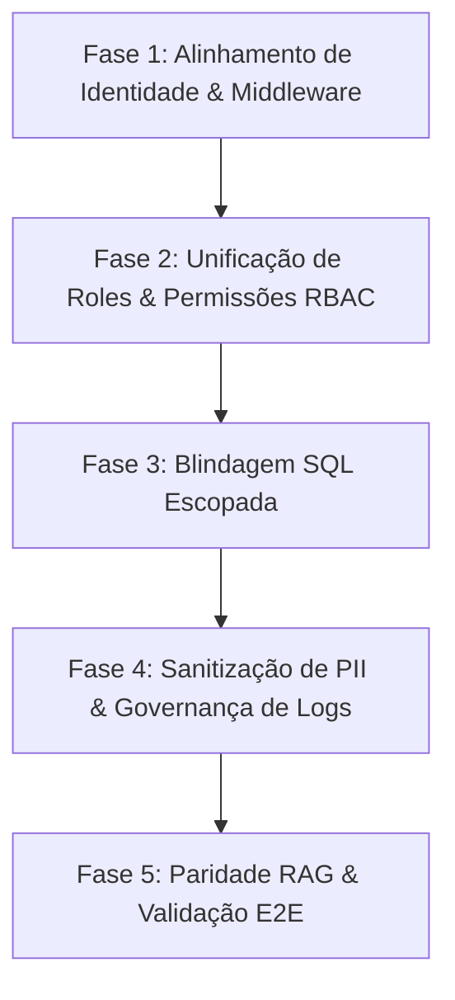

# Plano de Hardening GRC e Alinhamento de Identidades

Este documento detalha o planejamento estratégico composto por fases, épicos e issues detalhadas para endereçar os débitos técnicos, reconciliar os modelos de autenticação e RBAC, blindar o multi-tenancy a nível de banco de dados e garantir a governança de dados sensíveis nas auditorias do **Standard**.

---

## 1. Estrutura de Fases do Projeto

O cronograma de implementação é dividido em 5 fases sequenciais para minimizar riscos de regressão e garantir que cada camada da arquitetura (Gateway -> Middleware -> Repositórios -> Infraestrutura -> Testes) seja validada individualmente.



---

## 2. Épicos e Issues Detalhadas

---

### Épico 1: Resolução Antecipada do Identity Bridge (Better-Auth para UUIDs)
* **Objetivo:** Garantir que o mapeamento entre IDs textuais (ex: `"org_pa5khl"`) e os UUIDs do banco de dados ocorra logo no middleware de autenticação, eliminando conversões redundantes e ad-hoc nas rotas e prevenindo falhas de inserção de chaves estrangeiras.

#### `IP-1.1`: Refatorar `resolveAuthContext` para Resolução JIT de UUIDs
* **Descrição:** Modificar o middleware `resolveAuthContext` em `apps/api-gateway/src/middleware/auth.middleware.ts` para que, na validação de cookies/sessões do Better-Auth, ele chame `resolveTenantContext` e atribua os UUIDs finais mapeados diretamente a `context.organizationId` e `context.organizationId`.
* **Arquivos Alvo:**
  * [auth.middleware.ts](file:///c:/Users/resper/OneDrive/Área de Trabalho/aegis-api/apps/api-gateway/src/middleware/auth.middleware.ts)
* **Critérios de Aceite:**
  * `context.organizationId` e `context.organizationId` devem ser UUIDs válidos a partir da saída do middleware de autenticação.
  * Preservar o fluxo M2M (onde os tokens da API já carregam UUIDs).
  * Lançar erro apropriado ou fallback seguro se a conversão falhar.
* **Plano de Verificação:**
  * Adicionar asserções de tipo `z.string().uuid()` para verificar `organizationId` nos testes de integração do gateway.

#### `IP-1.2`: Higienizar Rotas e Remover Resoluções Ad-hoc
* **Descrição:** Limpar os arquivos de rotas para consumir o contexto do Hono já resolvido em UUID. Remover chamadas manuais repetitivas a `deps.resolveTenantContext`.
* **Arquivos Alvo:**
  * [assessments.routes.ts](file:///c:/Users/resper/OneDrive/Área de Trabalho/aegis-api/apps/api-gateway/src/routes/assessments.routes.ts)
  * [api-keys.routes.ts](file:///c:/Users/resper/OneDrive/Área de Trabalho/aegis-api/apps/api-gateway/src/routes/api-keys.routes.ts)
* **Critérios de Aceite:**
  * Sem try/catch manuais de conversão de ID de organization nos manipuladores de rotas.
  * Todas as rotas de domínio GRC devem operar sob a premissa de que `context.organizationId` é estritamente um UUID.
* **Plano de Verificação:**
  * Rodar `pnpm typecheck` para garantir consistência de tipos nos endpoints limpos.

---

### Épico 2: Unificação de Roles e Permissões (GRC RBAC Alignment)
* **Objetivo:** Unificar as roles simplificadas do Better-Auth (owner, admin, member, viewer) com as roles granulares do domínio GRC (assessor, approver, reviewer, etc.) definidas no pacote de segurança, evitando permissões quebradas ou bypass total de rotas.

#### `IP-2.1`: Reconciliar Dicionário de Permissões e Roles
* **Descrição:** Alinhar `packages/auth/src/permissions.ts` e `packages/security/src/constants.ts` para que utilizem um dicionário unificado de papéis e privilégios. Adicionar mapeamentos explícitos que traduzam as roles de sessão em níveis de acesso do GRC.
* **Arquivos Alvo:**
  * [permissions.ts](file:///c:/Users/resper/OneDrive/Área de Trabalho/aegis-api/packages/auth/src/permissions.ts)
  * [constants.ts](file:///c:/Users/resper/OneDrive/Área de Trabalho/aegis-api/packages/security/src/constants.ts)
* **Critérios de Aceite:**
  * Todas as 40+ permissões estruturadas no GRC (ex: `soa:approve`, `gap:submit_review`) devem constar como chaves válidas.
  * Papéis como `assessor` e `approver` devem ser representados sem degradação para o nível genérico de leitura (`viewer`).
* **Plano de Verificação:**
  * Teste unitário comparando a interseção de chaves de permissão exportadas pelos dois pacotes.

#### `IP-2.2`: Atualizar Middleware de RBAC (`assertRbac`)
* **Descrição:** Ajustar a lógica de verificação de permissões em `rbac.middleware.ts` para resolver hierarquicamente as permissões das roles organizacionais (Better-Auth memberships) e atribuir privilégios dinamicamente com base nas permissões consolidadas do GRC.
* **Arquivos Alvo:**
  * [rbac.middleware.ts](file:///c:/Users/resper/OneDrive/Área de Trabalho/aegis-api/apps/api-gateway/src/middleware/rbac.middleware.ts)
* **Critérios de Aceite:**
  * Garantir que usuários com role `assessor` consigam criar e atualizar artefatos, mas falhem ao tentar invocar a rota de aprovação (`soa:approve`, `gap:approve`).
  * Manter o bypass explícito para `platform_admin`.
* **Plano de Verificação:**
  * Executar a suite de testes de segurança (`pnpm test`) e checar especificamente `api-security.test.ts`.

---

### Épico 3: Blindagem SQL Escopada (Defense in Depth)
* **Objetivo:** Impedir vazamento ou modificações cross-organization no banco de dados, aplicando filtragem de segurança de forma redundante em todas as queries SQL de alteração (`update`, `delete`, `insert`) no Drizzle ORM.

#### `IP-3.1`: Hardening no Ingestion Adapter
* **Descrição:** Alterar o repositório de documentos de ingestão para garantir que todas as cláusulas `where` exijam correspondência exata do ID do documento e do `organizationId`.
* **Arquivos Alvo:**
  * [document-ingestion.repository.ts](file:///c:/Users/resper/OneDrive/Área de Trabalho/aegis-api/apps/api-gateway/src/adapters/document-ingestion.repository.ts)
* **Critérios de Aceite:**
  * O método `update` ou `archive` deve retornar `null` ou lançar erro se o documento pertencer a outro organization.
* **Plano de Verificação:**
  * Criar teste de integração injetando um ID de documento válido associado a um organization B em uma requisição autenticada no organization A e verificar que a escrita é negada.

#### `IP-3.2`: Hardening dos Repositórios GRC (Gap, SoA, POAM, Maturity)
* **Descrição:** Revisar os adapters do Drizzle ORM nos pacotes de domínio sob `packages/` para garantir isolamento absoluto nas queries de escrita.
* **Arquivos Alvo:**
  * `packages/gap-analysis/src/repositories/`
  * `packages/soa/src/repositories/`
  * `packages/poam/src/repositories/`
  * `packages/maturity/src/repositories/`
* **Critérios de Aceite:**
  * Nenhuma operação de banco de dados do tipo Drizzle `.update()` ou `.delete()` pode rodar sem incluir `eq(table.organizationId, organizationId)` na cláusula `where`.
* **Plano de Verificação:**
  * Realizar auditoria via typecheck e verificação estática das queries compiladas.

---

### Épico 4: Sanitização de PII em Auditoria (Allowlist de Metadados)
* **Objetivo:** Evitar vazamento acidental de dados pessoais (PII) ou chaves secretas na tabela `audit_logs`, substituindo a sanitização frágil baseada em exclusão manual (blocklist) por uma modelagem estrita baseada em chaves autorizadas (allowlist).

#### `IP-4.1`: Configurar `AuditMetadataAllowlist`
* **Descrição:** Centralizar uma lista estática de chaves seguras que podem constar nas colunas de metadados de auditoria. Exemplo: `trace_id`, `actor_id`, `route`, `scf_version`, `framework_id`.
* **Arquivos Alvo:**
  * [observability.ts](file:///c:/Users/resper/OneDrive/Área de Trabalho/aegis-api/packages/schemas/src/observability.ts) ou novo arquivo de constantes de segurança.
* **Critérios de Aceite:**
  * Estrutura de validação robusta utilizando Zod para filtrar campos não autorizados antes da gravação de logs.
* **Plano de Verificação:**
  * Teste unitário validando que chaves como `password`, `token`, `secret` e `cpf` são sumariamente expurgadas do objeto final de metadados.

#### `IP-4.2`: Refatorar Sinks de Auditoria
* **Descrição:** Modificar `createDrizzleAuditRepository` para aplicar a Allowlist no parâmetro `metadata` recebido antes de fazer a inserção na tabela `audit_logs`.
* **Arquivos Alvo:**
  * [audit.repository.ts](file:///c:/Users/resper/OneDrive/Área de Trabalho/aegis-api/apps/api-gateway/src/adapters/audit.repository.ts)
* **Critérios de Aceite:**
  * Todos os metadados gerados por roteamento HTTP ou ações de agentes LLM devem passar pelo crivo da allowlist.
* **Plano de Verificação:**
  * Executar uma rota com payload de simulação contendo campos extras de PII e conferir no banco de dados se esses campos foram higienizados (removidos).

---

### Épico 5: Paridade de Ingestão RAG & Validação E2E local
* **Objetivo:** Desenvolver testes de integração robustos rodando localmente para simular o ciclo de vida completo de ingestão assíncrona, embeddings e RAG.

#### `IP-5.1`: Mocks de Armazenamento e Indexação (R2 & Vectorize)
* **Descrição:** Implementar uma simulação completa e aderente das APIs do Cloudflare R2 e do Cloudflare Vectorize no ambiente de testes local.
* **Arquivos Alvo:**
  * `tests/mocks/`
* **Critérios de Aceite:**
  * O mock deve lançar exceções realistas de rede e tamanho de arquivo quando atingido limites estipulados no `DEFAULT_FILE_SECURITY_POLICY`.
* **Plano de Verificação:**
  * Rodar smoke tests com inputs gigantes e validar o lançamento de exceções.

#### `IP-5.2`: Testes de Integração de Fluxo Completo (E2E)
* **Descrição:** Criar testes em `tests/integration` que validem todo o lifecycle do assessment de ponta a ponta: Upload do Documento -> Processamento Parser -> Criação de Chunks na KB -> Busca Semântica -> Auditoria.
* **Arquivos Alvo:**
  * [ingestion-integration.test.ts](file:///c:/Users/resper/OneDrive/Área de Trabalho/aegis-api/tests/integration/ingestion-integration.test.ts) (Novo arquivo)
* **Critérios de Aceite:**
  * Cobertura de testes garantindo que o status do assessment transicione corretamente (ex: `documents_uploaded` -> `documents_ingested` -> `soa_drafted`).
* **Plano de Verificação:**
  * `pnpm test` deve passar com 100% de sucesso sem depender de conexões a serviços Cloudflare externos (rodando em sandbox local).

---

## 3. Matriz de Dependência e Critérios de Conclusão

```
[Fase 1] Mapeamento antecipado de UUIDs (Mínimo para evitar SQL errors de chaves estrangeiras)
   │
   └── [Fase 2] Alinhamento do RBAC unificado
         │
         └── [Fase 3] Blindagem SQL Multi-organization (Depende dos UUIDs devidamente propagados)
               │
               └── [Fase 4 & 5] Governança de Logs & Testes E2E
```

### Definição de Conclusão (Definition of Done)
1. Código compila com `pnpm typecheck` limpo.
2. Suite de testes unitários e de integração passa com sucesso (`pnpm test`).
3. Migrations de banco criadas caso ocorra alteração em tabelas de autenticação/RBAC.
4. Co-autoria registrada nos commits git.
