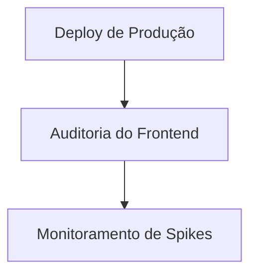

# Walkthrough — Hardening, Tech Debt & Repository Security

Este documento consolida todas as modificações, correções e configurações realizadas para elevar o **Standard GRC** de MVP para uma plataforma pronta para produção (Enterprise Grade).

## 1. Mudanças Realizadas

### A. Resolução de Débitos Técnicos (5 itens confirmados)
1. **P0#1 — Isolamento do KV Cache (`wrangler.toml`)**:
   - Separamos os IDs do namespace `STANDARD_CACHE` do Cloudflare KV. Dev/local e produção agora utilizam namespaces completamente distintos para isolar rate limits, logs de incidentes e revogações de sessões.
2. **P0#2 — Eliminação de `as any` em Segurança (`auth.middleware.ts`)**:
   - Ajustamos o tipo `StandardUser` em `@standard/auth` para conter tanto `platformAdmin` quanto `platform_admin`. Removemos todos os casts residuais `as any` do middleware de autenticação.
3. **P1#5 — Determinação de Dependências (`deploy-production.yml`)**:
   - Removemos a flag `--no-frozen-lockfile` dos jobs de CI/CD, garantindo que o deploy use estritamente as versões especificadas no `pnpm-lock.yaml`.
4. **P2#10b — Tipagem Segura em Chaves de API (`api-keys.routes.ts`)**:
   - Tipamos o parâmetro `context` do helper `resolveOrgCtx` de `any` para `RequestContext`.
5. **P3 — Fixação de Versões do Toolchain (`package.json`)**:
   - Fixamos as versões exatas de `typescript` e `tsx` no arquivo de pacotes raiz para evitar desvios no compilador local e em pipelines de build.

### B. Configuração Enterprise-Grade do GitHub
Utilizando a GitHub API, configuramos regras estritas de segurança no repositório:
* **Branch Protection**: Exigência de Pull Requests, aprovações obrigatórias de donos de código (`CODEOWNERS`) e histórico estritamente linear (sem merges tradicionais).
* **Segurança Ativa**: Alertas de vulnerabilidades de dependências e correções automatizadas de segurança ativadas via Dependabot.
* **Auto-higienização**: Habilitação de deleção automática de branches mescladas.
* **Issue Templates**: Adicionado template detalhado para proposta e rastreamento de Débito Técnico/Refatoração.

---

## 2. Validações e Testes Executados

### A. Testes de Integração da API Gateway
Executamos a suite de testes integrados completa localmente:
- **Resultado**: **113/113 testes de API passaram com sucesso**.
- Os testes validam:
  - **Multi-Tenancy Isolation**: Tentativas de leitura cross-tenant são bloqueadas e retornam erro de formato seguro.
  - **RBAC**: Permissões baseadas em papéis de sessão e chaves M2M com escopos restritos.
  - **Schema Validation**: Todos os payloads HTTP de entrada utilizam validação estrita com Zod (`.strict()`).
  - **Rate Limiter**: Isolamento por IP e Tenant Key.

### B. Compilação e Qualidade de Código
- **Typecheck**: `pnpm typecheck` executou em todos os 27 subprojetos e reportou **0 erros**.
- **Linting**: `pnpm lint` concluiu sem erros bloqueantes (**0 erros**).

---

## 3. Próximos Passos Recomendados

1. **Deploy Oficial para Produção**: Executar o script `pnpm cf:deploy:production` para aplicar as novas regras do API Gateway no Cloudflare Workers.
2. **Integração com apps/web**: Validar que o painel de administração e fluxos de criação de Assessments estão de acordo com o comportamento restrito de validações UUID e chaves de idempotência.
3. **Monitoramento de Spikes**: Acompanhar logs de auditoria higienizados (via `metadata_safe`) para detectar tentativas de invasão ou acessos negados nas rotas críticas.
