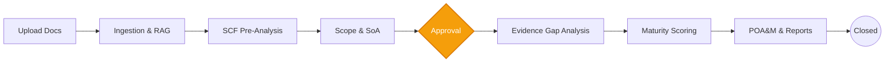

<div align="center">

# Standard GRC Platform

**Automate security, compliance, and gap analyses across 231+ frameworks with Agentic AI.**

[](https://github.com/resper1965/standard-api/actions)
[](https://github.com/resper1965/standard-api/actions)
[](https://workers.cloudflare.com/)
[-00e599?style=for-the-badge&logo=postgresql)](https://neon.tech)
[](LICENSE)

</div>

---

**Standard** is an enterprise-grade compliance assessment API. It automates security evaluations against SOC 2, ISO 27001, HIPAA, NIST, and 231+ regulatory frameworks. By uploading your security documents, Standard's AI agents analyze them against the **Secure Controls Framework (1,468 controls, 32,903 requirements, 15,717 crosswalk mappings)** to automatically produce gap analyses, maturity scores, remediation plans, and audit-ready reports.

*Your application calls the API — Standard does the compliance intelligence.*

## 🚀 Quickstart

Get started instantly without spinning up heavy infrastructure. Standard runs on the Edge.

```bash
# Health check (no auth required)
curl https://standard-api.bekaa.eu/health

# List compliance frameworks
curl -H "Authorization: ApiKey YOUR_KEY" \
  https://standard-api.bekaa.eu/api/v1/scf/frameworks

# Create an assessment
curl -X POST -H "Authorization: ApiKey YOUR_KEY" \
  -H "Content-Type: application/json" \
  -d '{"organization_id":"YOUR_ORG","name":"Q2 Assessment"}' \
  https://standard-api.bekaa.eu/api/v1/assessments
```

> **Explore the API:** [Interactive API Explorer](https://standard-api.bekaa.eu/docs) | [Cookbook](https://standard-api.bekaa.eu/docs/cookbook)

---

## 🧠 The Agentic Assessment Model

The core of Standard is our **Agentic Assessment Model**. Specialized AI agents collaborate under controlled orchestration to automate the entire compliance lifecycle while maintaining strict schema validation, human-in-the-loop approvals, and absolute traceability.



---

## 🏛️ Arc42 Architecture

Our system architecture is comprehensively documented using the **Arc42 Framework** and **C4 Model**.

👉 **[Read the Full Arc42 Architecture Documentation](docs/architecture/arc42.md)**

### Key Technical Pillars
*   **API-First & SaaS-Ready**: Every functional lifecycle is exposed via API (`/api/v1`).
*   **Multi-Tenant Isolation (User=Tenant)**: Deep isolation across all PostgreSQL tables and Cloudflare assets.
*   **Edge-Native Infrastructure**: Built heavily on Cloudflare (Workers, Workflows, Queues, R2, Vectorize).
*   **Security & Guardrails**: Enforced API keys (SHA-256), AI Gateway for prompt injection defense, and strict tenant boundary isolation.

---

## 📚 Documentation Hub

We believe that great architecture requires great documentation. Our knowledge base is organized to help you navigate the codebase quickly.

| Topic | Primary Resource | Description |
| :--- | :--- | :--- |
| **For Developers** | [Developer Guide](docs/developer-guide.md) | How to authenticate, consume APIs, and handle async polling workflows. |
| **System Architecture** | [Arc42 Document](docs/architecture/arc42.md) | Complete system context, containers, and structural decisions. |
| **Data Model** | [Data Architecture](docs/architecture/data-model.md) | PostgreSQL schemas, tenancy isolation, and state transitions. |
| **Agent Behavior** | [Agentic AI Model](docs/architecture/standard-agentic-ai-operating-model.md) | How the AI specialists interact, handle memory, and validate schemas. |
| **Public API** | [OpenAPI Spec](docs/api/openapi.yaml) | Full specification of our RESTful API endpoints. |
| **Project Context** | [CONTEXT.md](CONTEXT.md) | Development context and glossary. |

*For a full index of architectural decisions and detailed module descriptions, browse the `docs/` folder.*

---

## ⚙️ Local Development Environment

We use a modern `pnpm` monorepo with Dockerized PostgreSQL for a clean local setup.

```bash
# 1. Install dependencies
pnpm install

# 2. Start local PostgreSQL database
docker compose -f infra/docker/docker-compose.yml up -d

# 3. Apply database migrations
pnpm db:migrate

# 4. Start the API Gateway and Web Application
pnpm dev
```

For background jobs, run the workers in separate terminals:
```bash
pnpm dev:workflows
pnpm dev:queues
pnpm dev:ingestion
```

---

## 🛡️ Security & Audits

We take security seriously. All platform capabilities enforce zero-trust principles.
*   For vulnerability reporting, please see our [Security Policy](SECURITY.md).
*   Our `/.well-known/security.txt` is active in production.

## 🤝 Contributing

We welcome contributions to the Standard GRC ecosystem! 
Please review our [Contributing Guidelines](CONTRIBUTING.md) to understand our branching strategy, AI commitments, and testing requirements.

---

<p align="center">
  <br>
  Built with ❤️ for Security & Compliance Teams. <br>
  Licensed under the <a href="LICENSE">Business Source License 1.1</a>.
</p>

