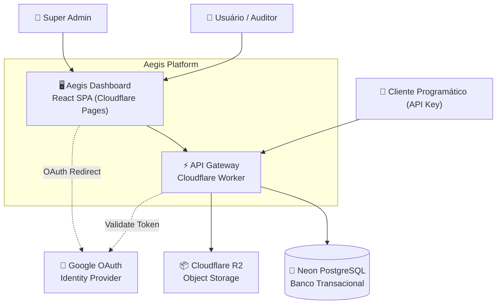
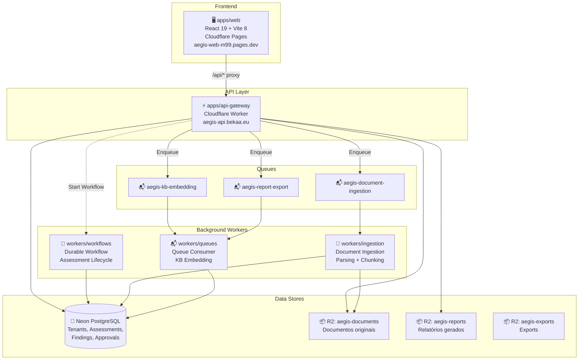
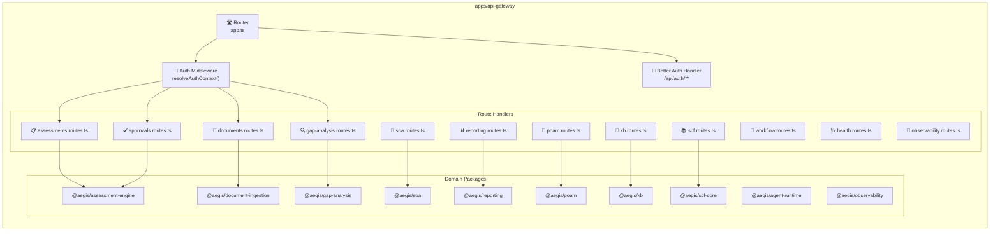
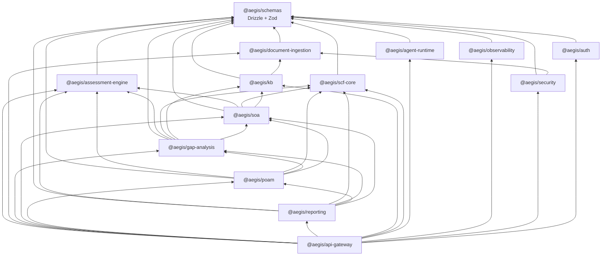
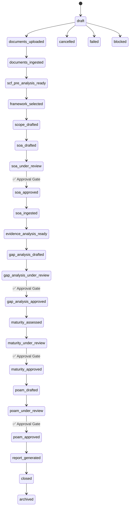
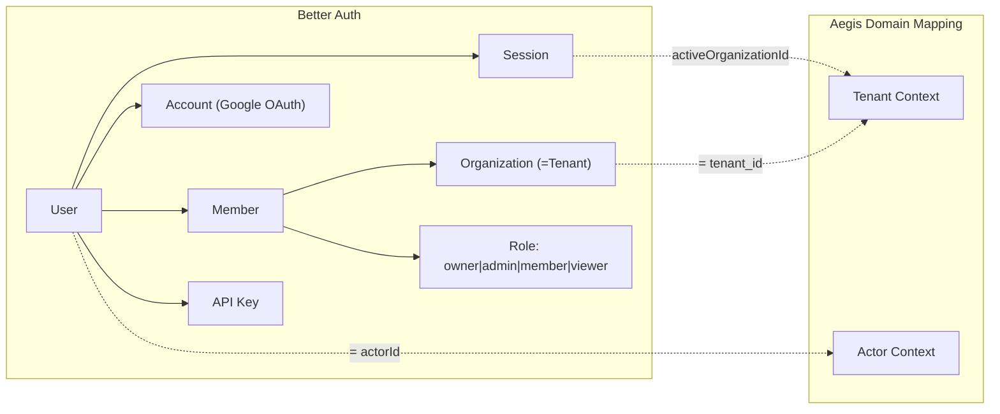

# Reversa — Fase 3: Arquitetura C4

> Gerado em 2026-05-02 por Antigravity
> Projeto: aegis-api-standard v0.1.0

---

## Diagrama C4 — Nível 1: Contexto do Sistema

## Diagrama C4 — Nível 2: Containers

## Diagrama C4 — Nível 3: Componentes do API Gateway

## Diagrama de Dependências entre Packages

## Assessment Lifecycle State Machine

## Identity & RBAC Model

