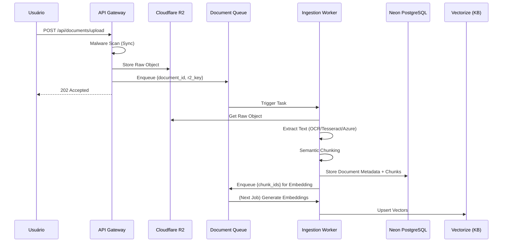
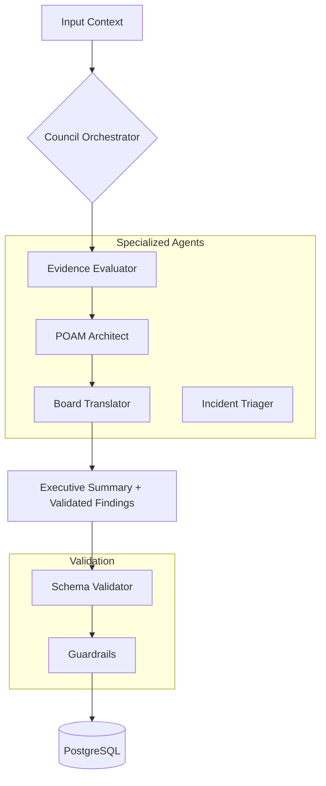

# Reversa — Fase 4: Fluxo de Dados

> Gerado em 2026-05-23 por Antigravity
> Projeto: standard-api-standard v0.1.0

---

## 1. Pipeline de Ingestão de Documentos (RAG)

O fluxo de ingestão transforma documentos brutos (comprovantes de conformidade) em conhecimento semântico para os agentes IA.

---

## 2. Ciclo de Vida do Assessment (Workflow)

A transição entre estados do assessment é garantida por Cloudflare Workflows para garantir durabilidade em processos que podem durar semanas.

| Fase | Gatilho | Ação | Output Esperado |
|---|---|---|---|
| Ingestão | Upload Finalizado | `processDocumentIngestionJob` | KB Populada |
| Escopo | Seleção de Framework | `generateDraftSoA` | SoA Draft |
| SoA Approval | Ação Humana | `approveSoA` | SoA Base-line |
| Análise | SoA Aprovado | `dispatchCouncilAnalysis` | Findings + Gaps |
| POA&M | Gap Approved | `generatePoamDraft` | POA&M Plan |

---

## 3. Orquestração de Agentes (Council)

O "Council" coordena agentes especializados para análise profunda e validação normativa.

### Regras de Ouro da Orquestração:
1. **Schema Validation:** Nenhum output de agente é gravado sem validar contra o Zod schema em `@standard/schemas`.
2. **Traceability:** Todo run de agente gera um `agent_run_id` e é vinculado a um `trace_id`.
3. **Normative Source:** Agentes consultam o `@standard/scf-core` via repositórios específicos; nunca alucinam mapeamentos.

---

## 4. Próximos Passos (Reversa)
- Fase 5: Mapeamento de Dependências de Runtime (CORS, ENV, Secrets).
- Fase 6: Diagnóstico de Saúde e Dívida Técnica.
