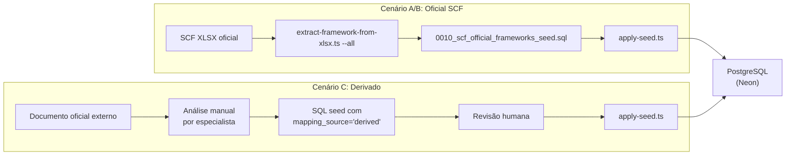

---
title: "Processo: Incorporação de Frameworks no Standard"
---

# Processo: Incorporação de Frameworks no Standard

Este documento descreve como incorporar novos frameworks de conformidade/segurança ao Standard, a partir de fontes oficiais.

---

## Cenários de Incorporação

| Cenário | Fonte | `mapping_source` | `is_official` | Exemplo |
|---|---|---|---|---|
| **A** — Framework já existe no SCF XLSX | SCF oficial | `official_scf` | `true` | LGPD, GDPR, NIST CSF |
| **B** — Nova versão do SCF XLSX | SCF oficial (nova versão) | `official_scf` | `true` | SCF 2027.x |
| **C** — Framework não existe no SCF XLSX | Documento oficial externo | `derived` | `false` | QNRCS (Portugal) |
| **D** — Framework proprietário/interno | Norma interna do cliente | `consultative` | `false` | Policy interna |

---

## Cenário A: Framework já presente no SCF XLSX

> O framework já está mapeado no workbook oficial SCF. É o cenário mais simples.

### Passo 1: Verificar existência

```powershell
npx tsx packages/scf-core/scripts/extract-framework-from-xlsx.ts `
  "assets/Secure Controls Framework (SCF) - 2026.1.1.xlsx" --list `
  | Select-String "LGPD"
```

**Saída esperada:**
```
  [183] BR-LGPD                        Americas / Brazil / LGPD
```

### Passo 2: Extrair individualmente (opcional, para validação)

```powershell
npx tsx packages/scf-core/scripts/extract-framework-from-xlsx.ts `
  "assets/Secure Controls Framework (SCF) - 2026.1.1.xlsx" `
  --framework BR-LGPD
```

Gera: `infra/docker/postgres/seeds/0010_br-lgpd_official_seed.sql`

### Passo 3: Extrair consolidado (produção)

```powershell
npx tsx packages/scf-core/scripts/extract-framework-from-xlsx.ts `
  "assets/Secure Controls Framework (SCF) - 2026.1.1.xlsx" --all
```

Gera: `infra/docker/postgres/seeds/0010_scf_official_frameworks_seed.sql` (todos os 233+ frameworks)

### Passo 4: Aplicar no banco

```powershell
npx tsx packages/scf-core/scripts/apply-seed.ts
```

> **Nota:** Usa `ON CONFLICT DO NOTHING/UPDATE`, portanto é idempotente e seguro para re-execução.

---

## Cenário B: Nova versão do SCF XLSX

> O SCF publica novas versões periodicamente. O processo é:

### Passo 1: Baixar o novo XLSX

Fonte: [https://securecontrolsframework.com/scf-download/](https://securecontrolsframework.com/scf-download/)

### Passo 2: Versionar no repositório

```powershell
# Colocar o novo XLSX em assets/
cp "~/Downloads/Secure Controls Framework (SCF) - 2027.1.xlsx" "assets/"
```

### Passo 3: Registrar nova versão no banco

```sql
INSERT INTO scf_versions (version, source_uri, published_at)
VALUES (
  '2027.1',
  'https://securecontrolsframework.com/scf-download/',
  '2027-01-15T00:00:00Z'
);
```

### Passo 4: Inspecionar headers (verificar mudanças estruturais)

```powershell
npx tsx packages/scf-core/scripts/inspect-xlsx-headers.ts `
  "assets/Secure Controls Framework (SCF) - 2027.1.xlsx"
```

> ⚠️ Verificar se a estrutura de colunas mudou. Se mudou, o `extract-framework-from-xlsx.ts` pode precisar de ajustes.

### Passo 5: Extrair e aplicar

```powershell
npx tsx packages/scf-core/scripts/extract-framework-from-xlsx.ts `
  "assets/Secure Controls Framework (SCF) - 2027.1.xlsx" --all

npx tsx packages/scf-core/scripts/apply-seed.ts
```

### Passo 6: Validar

```powershell
npx tsx packages/scf-core/scripts/_check-db.ts
```

### Passo 7: Documentar

- Atualizar `CONTEXT.md` ou `docs/decisions/` com a mudança de versão
- Git commit com referência à versão SCF

---

## Cenário C: Framework NÃO presente no SCF XLSX

> Para frameworks que não existem no mapeamento oficial do SCF (ex: QNRCS de Portugal, normas setoriais locais).

### Regras obrigatórias (AGENTS.md)

- `mapping_source = 'derived'` — **NUNCA** `official_scf`
- `is_official = false` — **NUNCA** `true`
- Documentar explicitamente que é mapeamento derivado
- Registrar quem fez o mapeamento, data, e referência ao documento fonte

### Passo 1: Criar o arquivo de mapeamento

Criar um novo seed SQL em `infra/docker/postgres/seeds/`:

```sql
-- ============================================================
-- Standard Derived Framework Seed: [Nome do Framework]
-- Source: [URL ou referência ao documento oficial]
-- Mapping source: derived (NOT in official SCF XLSX)
-- Created by: [autor]
-- Date: [data]
-- ============================================================

-- IMPORTANTE: Este framework NÃO existe no SCF XLSX oficial.
-- Os mapeamentos abaixo foram derivados manualmente a partir da
-- análise do documento fonte contra os controles SCF.

BEGIN;

-- Framework
INSERT INTO scf_frameworks (scf_version_id, framework_id, name, publisher, jurisdiction, status, is_synthetic)
SELECT
  v.id,
  'PT-QNRCS',                    -- código único
  'Quadro Nacional de Referência para a Cibersegurança',
  'CNCS Portugal',                -- publisher oficial
  'EMEA / Portugal',              -- jurisdição
  'active',
  false
FROM scf_versions v
ORDER BY v.created_at DESC LIMIT 1
ON CONFLICT (scf_version_id, framework_id) DO UPDATE SET
  name = EXCLUDED.name;

-- Requirements (extraídos do documento oficial)
INSERT INTO scf_framework_requirements (scf_version_id, scf_framework_id, requirement_code, title, sort_order, status, is_synthetic)
SELECT
  f.scf_version_id, f.id,
  'QNRCS-ID.AM-1',              -- código do requisito
  'Inventariação de ativos',      -- título
  1,                              -- ordem
  'active', false
FROM scf_frameworks f
WHERE f.framework_id = 'PT-QNRCS'
ORDER BY f.created_at DESC LIMIT 1
ON CONFLICT (scf_framework_id, requirement_code) DO NOTHING;

-- Mappings (derivados — NÃO oficiais)
INSERT INTO scf_mappings (scf_version_id, scf_framework_requirement_id, scf_control_id,
  relationship_type, mapping_source, is_official, status, is_synthetic)
SELECT
  r.scf_version_id, r.id, c.id,
  'related',
  'derived',                     -- ← NUNCA 'official_scf'
  false,                         -- ← NUNCA true
  'active', false
FROM scf_framework_requirements r
JOIN scf_frameworks f ON f.id = r.scf_framework_id AND f.framework_id = 'PT-QNRCS'
JOIN scf_controls c ON c.control_code = 'AST-01' AND c.scf_version_id = r.scf_version_id
WHERE r.requirement_code = 'QNRCS-ID.AM-1'
ORDER BY r.created_at DESC LIMIT 1
ON CONFLICT (scf_framework_requirement_id, scf_control_id) DO NOTHING;

COMMIT;
```

### Passo 2: Revisão humana obrigatória

> ⚠️ Mapeamentos derivados **devem** ser revisados por um humano antes de serem usados em assessments de produção.

### Passo 3: Aplicar

```powershell
npx tsx packages/scf-core/scripts/apply-seed.ts `
  "infra/docker/postgres/seeds/0015_pt_qnrcs_derived_seed.sql"
```

---

## Cenário D: Framework proprietário/interno

Idêntico ao Cenário C, mas com `mapping_source = 'consultative'`.

---

## Verificação Pós-Incorporação

Após qualquer incorporação, validar:

```powershell
# Verificar contagens
npx tsx packages/scf-core/scripts/_check-db.ts

# Ou inline
npx tsx -e "
import { neon } from '@neondatabase/serverless';
import { readFileSync } from 'node:fs';
const env = readFileSync('.env','utf-8');
const m = env.match(/DATABASE_URL=\"([^\"]+)\"/);
const sql = neon(m[1]);
(async () => {
  const fws = await sql\`SELECT framework_id, name, 
    (SELECT COUNT(*) FROM scf_framework_requirements r WHERE r.scf_framework_id = f.id) as reqs,
    (SELECT COUNT(*) FROM scf_mappings m JOIN scf_framework_requirements r2 ON r2.id = m.scf_framework_requirement_id WHERE r2.scf_framework_id = f.id) as maps
    FROM scf_frameworks f WHERE f.is_synthetic = false ORDER BY f.framework_id\`;
  console.table(fws);
})()
"
```

---

## Pipeline Resumido



## Referências

- **Fonte oficial SCF:** [securecontrolsframework.com](https://securecontrolsframework.com/scf-download/)
- **ADR-0004:** `docs/decisions/0004-scf-data-source-of-truth.md`
- **AGENTS.md:** Seção 8 (SCF Data Rules)

