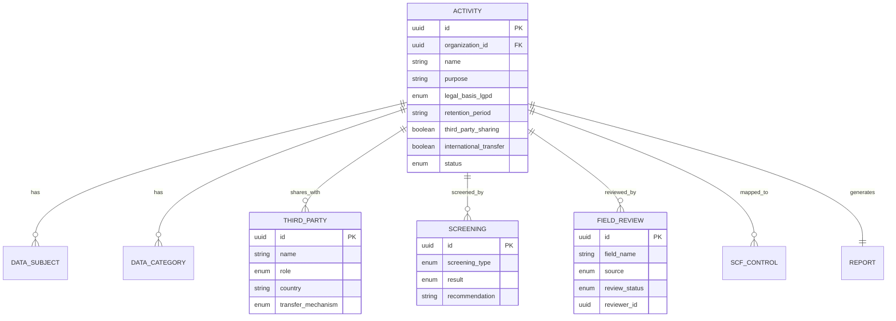

# Standard Privacy ROPA — SDK Reference

> **Version**: v1 | **Base URL**: `https://api.standard.dev/api/v1`
> **Auth**: Bearer token (header `Authorization: Bearer <token>`)
> **Organization**: Required (header `x-standard-tenant-id: <uuid>`)

---

## Table of Contents

1. [Quick Start — Text to ROPA](#quick-start)
2. [Complete Lifecycle](#complete-lifecycle)
3. [Endpoints Reference](#endpoints-reference)
4. [SDK TypeScript Client](#sdk-typescript-client)
5. [Data Model](#data-model)
6. [Compliance Philosophy](#compliance-philosophy)

---

## Quick Start — Text to ROPA {#quick-start}

The fastest way to create a ROPA entry is to send natural language text:

```bash
curl -X POST https://api.standard.dev/api/v1/privacy/processing-activities/from-text \
  -H "Authorization: Bearer $TOKEN" \
  -H "x-standard-tenant-id: $ORGANIZATION_ID" \
  -H "Content-Type: application/json" \
  -d '{
    "text": "Nós coletamos emails, nomes e CPFs dos nossos clientes para enviar campanhas de marketing. Compartilhamos os dados com a Mailchimp para disparo de emails. Guardamos por 2 anos. Temos consentimento via formulário web."
  }'
```

**Response** (`201 Created`):
```json
{
  "data": {
    "activity": {
      "id": "a1b2c3d4-...",
      "name": "Atividade: enviar campanhas de marketing",
      "status": "draft",
      "purpose": "enviar campanhas de marketing",
      "legal_basis_lgpd": "consent",
      "retention_period": "2 anos",
      "third_party_sharing": true
    },
    "field_reviews_created": 8,
    "pending_questions": [
      "Quais medidas de segurança são aplicadas?"
    ],
    "warnings": [
      "Dados sensíveis detectados. DPIA provavelmente necessário."
    ],
    "confidence": 75,
    "agent_model": "rule-based-v1",
    "compliance_assertion": false
  },
  "trace_id": "tr-xyz..."
}
```

> ⚠️ **`compliance_assertion` is ALWAYS `false`.** The system never certifies compliance. All values are suggestions requiring human review.

---

## Complete Lifecycle {#complete-lifecycle}

```
1. POST /from-text           → Create activity from natural language
   or POST /                 → Create activity from structured JSON

2. GET /:id/completeness     → Check what's missing

3. POST /:id/data-subjects   → Add who is affected
4. POST /:id/data-categories → Add what data is collected
5. POST /:id/third-parties   → Add who receives data

6. POST /:id/screen          → Run DPIA/LIA/TIA screening

7. GET /:id/field-reviews    → See AI suggestions
8. PUT /:id/field-reviews/:r → Approve or reject each

9. POST /:id/status          → Transition to "under_review"

10. GET /:id/report           → Generate ROPA report (JSON or Markdown)
```

### Status Flow

```
draft → needs_information → under_review → approved
  │                                          │
  └── archived                          rejected
```

---

## Endpoints Reference {#endpoints-reference}

### Activity CRUD

| Method | Path | Description |
|--------|------|-------------|
| `POST` | `/privacy/processing-activities` | Create activity |
| `GET` | `/privacy/processing-activities` | List activities (query: `?status=`, `?limit=`, `?offset=`) |
| `GET` | `/privacy/processing-activities/:id` | Get activity by ID |
| `PUT` | `/privacy/processing-activities/:id` | Update activity fields |
| `DELETE` | `/privacy/processing-activities/:id` | Soft-delete activity |

### Status & Completeness

| Method | Path | Description |
|--------|------|-------------|
| `POST` | `/privacy/processing-activities/:id/status` | Transition status |
| `GET` | `/privacy/processing-activities/:id/completeness` | Get completeness analysis |

### Data Subjects

| Method | Path | Description |
|--------|------|-------------|
| `POST` | `/privacy/processing-activities/:id/data-subjects` | Add data subjects (array) |
| `GET` | `/privacy/processing-activities/:id/data-subjects` | List data subjects |
| `DELETE` | `/privacy/processing-activities/:id/data-subjects/:subjectId` | Remove a data subject |

**Create body** (array):
```json
[
  { "category": "customers", "estimated_count": "~50000", "vulnerable_group": false },
  { "category": "employees", "estimated_count": "~200" }
]
```

Categories: `employees`, `customers`, `prospects`, `partners`, `suppliers`, `minors`, `patients`, `students`, `citizens`, `visitors`, `contractors`, `other`

### Data Categories

| Method | Path | Description |
|--------|------|-------------|
| `POST` | `/privacy/processing-activities/:id/data-categories` | Add data categories (array) |
| `GET` | `/privacy/processing-activities/:id/data-categories` | List data categories |
| `DELETE` | `/privacy/processing-activities/:id/data-categories/:categoryId` | Remove a data category |

**Create body** (array):
```json
[
  { "category_name": "Email addresses", "sensitivity": "personal" },
  { "category_name": "CPF (Tax ID)", "sensitivity": "sensitive", "source_of_data": "Web form" }
]
```

Sensitivity levels: `personal`, `sensitive`, `anonymized`, `pseudonymized`, `children`, `financial`, `health`, `biometric`, `genetic`, `political`, `religious`, `sexual`, `criminal`, `other`

### Third Parties

| Method | Path | Description |
|--------|------|-------------|
| `POST` | `/privacy/processing-activities/:id/third-parties` | Add third parties (array) |
| `GET` | `/privacy/processing-activities/:id/third-parties` | List third parties |
| `DELETE` | `/privacy/processing-activities/:id/third-parties/:partyId` | Remove a third party |

**Create body** (array):
```json
[
  {
    "name": "Mailchimp",
    "role": "processor",
    "country": "US",
    "purpose": "Email delivery",
    "data_shared": ["email", "name"],
    "transfer_mechanism": "standard_contractual_clauses"
  }
]
```

Roles: `processor`, `controller`, `joint_controller`, `sub_processor`, `recipient`, `other`

Transfer mechanisms: `adequacy_decision`, `standard_contractual_clauses`, `binding_corporate_rules`, `consent`, `contractual_necessity`, `legal_obligation`, `public_interest`, `vital_interests`, `not_applicable`, `other`

### Screenings (DPIA / LIA / TIA)

| Method | Path | Description |
|--------|------|-------------|
| `POST` | `/privacy/processing-activities/:id/screen` | Run automated screenings |
| `GET` | `/privacy/processing-activities/:id/screenings` | List previous screenings |

**Trigger rules:**

| Screening | Triggers When |
|-----------|---------------|
| **DPIA** | `large_scope_processing`, `systematic_monitoring`, `vulnerable_subjects`, or `automated_decision_making` is `true` |
| **LIA** | `legal_basis_lgpd` is `"legitimate_interest"` |
| **TIA** | `international_transfer` is `true` |

### Field Reviews (Human-in-the-Loop)

| Method | Path | Description |
|--------|------|-------------|
| `POST` | `/privacy/processing-activities/:id/field-reviews` | Create a field review |
| `GET` | `/privacy/processing-activities/:id/field-reviews` | List all field reviews |
| `PUT` | `/privacy/processing-activities/:id/field-reviews/:reviewId` | Approve/reject a review |

**Create body:**
```json
{
  "field_name": "purpose",
  "suggested_value": "Customer analytics",
  "source": "ai_suggestion",
  "comment": "Extracted from uploaded policy document"
}
```

**Update body** (approve/reject):
```json
{
  "review_status": "approved",
  "comment": "Confirmed by DPO on 2026-05-11"
}
```

Statuses: `pending`, `approved`, `rejected`, `needs_revision`
Sources: `human`, `ai_suggestion`, `system_rule`, `import`

### AI Extraction (Text → ROPA)

| Method | Path | Description |
|--------|------|-------------|
| `POST` | `/privacy/processing-activities/from-text` | Extract ROPA from natural language |

**Body:**
```json
{
  "text": "Full description of the processing activity in Portuguese or English..."
}
```

The AI extracts: purpose, legal basis, retention period, data subjects, data categories, third parties, risk flags. Every extracted field becomes a `field_review` requiring human approval.

### Reports

| Method | Path | Description |
|--------|------|-------------|
| `GET` | `/privacy/processing-activities/:id/report` | Generate ROPA report |
| | `?format=json` | JSON format (default) |
| | `?format=markdown` | Markdown with evidence matrix |

**Report includes:**
- Completeness score + can_submit status
- Every field with **origin tracking** (declared, ai_suggested, ai_approved, system_inferred, pending)
- Executive summary
- Third party table
- Screening results
- Gap list + warnings
- `compliance_assertion: false` (always)

---

## SDK TypeScript Client {#sdk-typescript-client}

```typescript
import type {
  CreatePrivacyActivityRequest,
  CreatePrivacyDataSubjectRequest,
  CreatePrivacyDataCategoryRequest,
  CreatePrivacyThirdPartyRequest,
  PrivacyActivityResponse,
  PrivacyThirdPartyResponse,
  PrivacyScreeningResponse,
  PrivacyFieldReviewResponse,
} from "@standard/schemas";

class StandardPrivacyClient {
  constructor(
    private baseUrl: string,
    private token: string,
    private organizationId: string,
  ) {}

  private async request<T>(method: string, path: string, body?: unknown): Promise<T> {
    const res = await fetch(`${this.baseUrl}/api/v1/privacy${path}`, {
      method,
      headers: {
        "Authorization": `Bearer ${this.token}`,
        "x-standard-tenant-id": this.organizationId,
        "Content-Type": "application/json",
      },
      body: body ? JSON.stringify(body) : undefined,
    });
    if (!res.ok) {
      const error = await res.json();
      throw new Error(`[${res.status}] ${error.message ?? JSON.stringify(error)}`);
    }
    const json = await res.json();
    return json.data;
  }

  // ─── Lifecycle ─────────────────────────────────────────────────

  /** Extract a ROPA entry from natural language */
  async extractFromText(text: string) {
    return this.request<{
      activity: PrivacyActivityResponse;
      field_reviews_created: number;
      pending_questions: string[];
      warnings: string[];
      confidence: number;
      compliance_assertion: false;
    }>("POST", "/processing-activities/from-text", { text });
  }

  /** Create a structured activity */
  async createActivity(data: CreatePrivacyActivityRequest) {
    return this.request<PrivacyActivityResponse>("POST", "/processing-activities", data);
  }

  /** Get activity by ID */
  async getActivity(id: string) {
    return this.request<PrivacyActivityResponse>("GET", `/processing-activities/${id}`);
  }

  /** Check completeness */
  async getCompleteness(activityId: string) {
    return this.request<{
      completeness_score: number;
      can_be_submitted_for_review: boolean;
      missing_required: string[];
      blocking_issues: Array<{ code: string; message: string; severity: string }>;
    }>("GET", `/processing-activities/${activityId}/completeness`);
  }

  // ─── Relations ─────────────────────────────────────────────────

  async addThirdParties(activityId: string, parties: CreatePrivacyThirdPartyRequest[]) {
    return this.request<PrivacyThirdPartyResponse[]>("POST", `/processing-activities/${activityId}/third-parties`, parties);
  }

  // ─── Screening ─────────────────────────────────────────────────

  async runScreening(activityId: string) {
    return this.request<PrivacyScreeningResponse[]>("POST", `/processing-activities/${activityId}/screen`);
  }

  // ─── Field Reviews ─────────────────────────────────────────────

  async listFieldReviews(activityId: string) {
    return this.request<PrivacyFieldReviewResponse[]>("GET", `/processing-activities/${activityId}/field-reviews`);
  }

  async approveFieldReview(activityId: string, reviewId: string, comment?: string) {
    return this.request<PrivacyFieldReviewResponse>("PUT", `/processing-activities/${activityId}/field-reviews/${reviewId}`, {
      review_status: "approved",
      comment,
    });
  }

  async rejectFieldReview(activityId: string, reviewId: string, comment: string) {
    return this.request<PrivacyFieldReviewResponse>("PUT", `/processing-activities/${activityId}/field-reviews/${reviewId}`, {
      review_status: "rejected",
      comment,
    });
  }

  // ─── Report ────────────────────────────────────────────────────

  async generateReport(activityId: string, format: "json" | "markdown" = "json") {
    return this.request<Record<string, unknown>>("GET", `/processing-activities/${activityId}/report?format=${format}`);
  }
}
```

### Usage Example

```typescript
const client = new StandardPrivacyClient(
  "https://api.standard.dev",
  "eyJ...",
  "organization-uuid"
);

// 1. Extract from text
const result = await client.extractFromText(
  "Coletamos emails e CPFs de clientes para marketing. " +
  "Compartilhamos com Mailchimp. Retemos por 2 anos. Temos consentimento."
);
console.log(`Activity ${result.activity.id} created with ${result.confidence}% confidence`);
console.log(`Pending questions: ${result.pending_questions.join(", ")}`);

// 2. Run screening
const screenings = await client.runScreening(result.activity.id);
const dpiaRequired = screenings.find(s => s.screening_type === "dpia")?.result === "required";
console.log(`DPIA required: ${dpiaRequired}`);

// 3. Review AI suggestions
const reviews = await client.listFieldReviews(result.activity.id);
for (const review of reviews) {
  if (review.source === "ai_suggestion" && review.review_status === "pending") {
    // DPO reviews each suggestion
    await client.approveFieldReview(result.activity.id, review.id, "Confirmed by DPO");
  }
}

// 4. Check completeness
const completeness = await client.getCompleteness(result.activity.id);
console.log(`Completeness: ${completeness.completeness_score}%`);

// 5. Generate report
const report = await client.generateReport(result.activity.id, "markdown");
console.log(report);
```

---

## Data Model {#data-model}



---

## Compliance Philosophy {#compliance-philosophy}

1. **The system NEVER asserts compliance.** `compliance_assertion: false` is hardcoded.
2. **AI suggests, humans decide.** Every AI-extracted field creates a `field_review` requiring human approval.
3. **Critical legal fields get double review.** `legal_basis_lgpd`, `retention_period`, `purpose`, and `dpia_required` always get a `system_rule` review in addition to the AI review.
4. **Absence of evidence ≠ absence of implementation.** The system reports gaps, not failures.
5. **Organization isolation is absolute.** Every query is scoped by `organization_id`. Cross-organization access returns empty, never throws (preventing information leakage).
