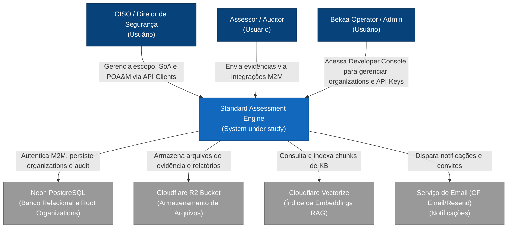
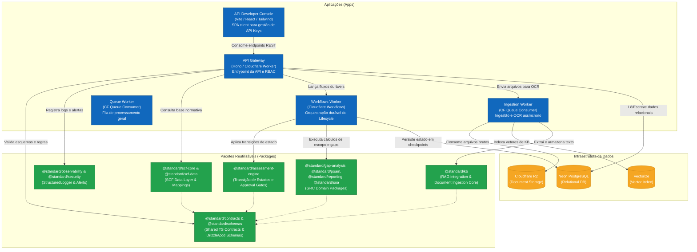
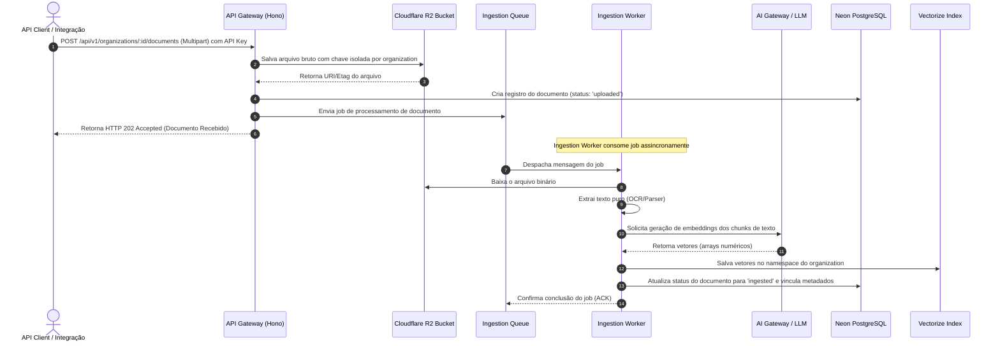
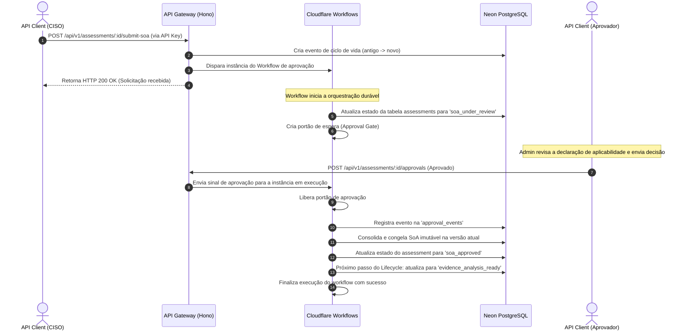

# Documento de Arquitetura de Software (Arc42) — Standard

Este documento descreve a arquitetura da plataforma **Standard**, um sistema SaaS API-first para assessments de conformidade e maturidade baseados no Secure Controls Framework (SCF).

---

## 1. Introdução e Objetivos

O **Standard** é projetado como um motor robusto para orquestrar o ciclo de vida de assessments de segurança corporativos. Ele substitui planilhas de conformidade estáticas por um modelo de IA agêntica integrado a uma base normativa centralizada (o Secure Controls Framework, SCF).

### 1.1 Objetivos de Negócio
- **API-first / SaaS-ready**: Todo o comportamento da plataforma é exposto via contratos de API reutilizáveis, permitindo integrações de terceiros e múltiplos consumidores.
- **Conformidade Estruturada**: Substituição de mapeamentos inferenciais ("ad-hoc RAG") por mapeamentos normativos oficiais estruturados no banco de dados.
- **Automação Inteligente**: Uso do *Standard SCF Agentic Assessment Model* para coletar evidências, analisar gaps de conformidade, propor atividades corretivas e estimar níveis de maturidade com supervisão humana.

### 1.2 Stakeholders Principais
- **CISOs e Diretores de Segurança**: Visualizam a cobertura de frameworks múltiplos (ISO 27001, NIST CSF, LGPD) e planejam investimentos.
- **Assessores / Auditores**: Coletam evidências, revisam gaps de conformidade e aprovam artefatos.
- **Engenheiros de Plataforma**: Consomem APIs para integrar a coleta de evidências do ambiente de infraestrutura na nuvem de forma contínua.

---

## 2. Restrições de Arquitetura

O desenho arquitetural do Standard é governado por restrições operacionais e tecnológicas específicas.

### 2.1 Restrições de Hardware e Nuvem (Edge Computing)
- **Cloudflare Workers (Runtime V8)**: Toda a camada de API e orquestração do gateway roda na borda da Cloudflare. Isto impõe:
  - **Limitações de CPU**: Limites rígidos de CPU (geralmente 50ms para sub-requisições Workers Unbound) para processar requisições.
  - **Sem Bibliotecas Node.js Nativas**: Bibliotecas que utilizam syscalls C/C++ ou APIs nativas do Node.js (ex: `fs`, `child_process`) não funcionam no Worker. A compatibilidade deve usar APIs baseadas em WinterCG.
  - **Tamanho do Bundle**: O bundle javascript compilado de cada Worker deve se manter o mais enxuto possível para otimizar os cold starts.

### 2.2 Restrições de Banco de Dados e Dados
- **PostgreSQL transacional (Neon)**: Os dados relacionais de tenancy, logs de auditoria e status de assessments exigem transações íntegras (Acid). A persistência é gerenciada via Neon PostgreSQL com adapter de pool de conexões edge-safe.
- **Integridade de Tipagem (UUID) e Identity Bridge**: Chaves estrangeiras que ligam logs de auditoria, eventos e assessments a usuários e organizations exigem estritamente o formato de ID `UUID`. Como a autenticação (Better-Auth) gera identificadores de organizações e sessões baseados em strings/slugs (ex: `org_pa5khl`), o gateway resolve essa diferença de tipagem aplicando um validador de formato UUID. IDs incompatíveis são setados como `null` nas colunas indexadas físicas e armazenados intactos dentro de metadados JSONB, eliminando a possibilidade de falhas de tipagem referencial ou de conversão SQL (erros 500) sem perder rastreabilidade.

### 2.3 Restrições de Identidade
- **Modelo Dual de Autenticação (Standard Native Auth v1.6.11)**: A plataforma adota um modelo dual de autenticação gerenciado pelo Standard Native Auth (better-auth v1.6.11) com Drizzle adapter no Neon PostgreSQL:
  - **Sessões (Platform Console)**: Autenticação de usuários humanos via email/password e Google OAuth, com sessões persistidas em banco e cookies seguros. Usado pelo Platform Console (`apps/web`) para gestão de organizations, users e API keys.
  - **M2M API Keys (SDK/MCP/Integrações)**: Acesso programático via header `Authorization: ApiKey <key>`. O gateway de API realiza validação do hash `SHA-256` na borda (Web Crypto API) e valida no Neon PostgreSQL, garantindo latência mínima e resolução implícita da hierarquia de *Root Organizations* e *Sub-Organizations*.
  - Ambos os canais são gerenciados nativamente pelo Standard Native Auth, com tabelas de autenticação (user, session, account, verification, activeOrganization) no Neon PostgreSQL. O plugin `@standard-native-auth/api-key` provisiona e controla M2M/API Keys integradas às contas de organizações.

---

## 3. Escopo e Contexto

O escopo e contexto delimitam as fronteiras do sistema **Standard**, identificando os atores (usuários humanos) e sistemas externos com os quais a plataforma se integra.

### 3.1 Contexto de Negócio e Técnico (C4 Context Diagram)

O diagrama a seguir representa o nível 1 (System Context) do C4 Model:



---

## 4. Estratégia de Solução

Para satisfazer os objetivos de negócio e contornar as restrições do Edge, a seguinte estratégia foi adotada:

### 4.1 Desacoplamento Monorepo (pnpm Workspaces)
O código está estruturado como um monorepo para garantir reuso máximo e separação de interesses:
- **`apps/api-gateway`**: Gateway Hono leve que roda nos Workers da Cloudflare. É o ponto de entrada da API.
- **`apps/web`**: Platform Console (SPA React/Vite) para gestão de organizations, users, API keys e observabilidade, hospedado no Cloudflare Pages. Não é dashboard GRC — consome a API REST para operações de plataforma.
- **`packages/*`**: Bibliotecas utilitárias e lógica de domínio pura (ex: `packages/scf-core` para a lógica do SCF, `packages/assessment-engine` para transições de estado de ciclo de vida).

### 4.2 Separação de Processamento Assíncrono (Queues & Workflows)
Operações que excedem as restrições de tempo de CPU dos Workers (como download e extração de metadados de documentos de evidência no R2, consultas de embedding no LLM, e execução de orquestrações de agentes) são movidas para fora do gateway de requisição imediata:
- **Cloudflare Queues**: Processamento de filas em lote e processamento assíncrono paralelo (ex: `standard-document-ingestion`).
- **Cloudflare Workflows**: Orquestração de workflows duráveis com persistência de checkpoints e portões de aprovação humana.

### 4.3 Camada de Cache em Memória Edge (Cloudflare KV)
Uso de KV na borda como cache de revogação de API keys e sessões comprometidas. A validação primária de sessões é feita via banco (Standard Native Auth); o KV armazena status de revogação para evitar consultas redundantes ao Neon PostgreSQL em cada requisição, otimizando latência no gateway.

---

## 5. Visão de Blocos (Building Block View)

A visão de blocos descreve a estrutura estática do monorepo, mapeando as aplicações (apps) e os componentes reutilizáveis (packages) no nível 2 (Container) do C4 Model.

### 5.1 Diagrama de Containers (C4 Container Diagram)

O diagrama a seguir descreve a decomposição interna da aplicação:



---

## 6. Visão de Runtime

A visão de runtime detalha a dinâmica operacional do sistema por meio de cenários de execução e diagramas de sequência de casos de uso cruciais.

### 6.1 Fluxo 1: Ingestão de Evidências e RAG Indexing (Processamento Assíncrono)

O fluxo a seguir ilustra a ingestão assíncrona de arquivos de evidência de conformidade:



### 6.2 Fluxo 2: Transição de Estados do Assessment com Aprovação Humana

O fluxo a seguir ilustra o controle durável do ciclo de vida usando Cloudflare Workflows:



---

## 7. Visão de Implantação (Deployment View)

A visão de implantação detalha a topologia de infraestrutura onde a plataforma Standard é fisicamente hospedada na nuvem da Cloudflare e no Neon.

### 7.1 Infraestrutura e Topologia Física (Deployment Diagram)

O diagrama a seguir representa o ambiente de implantação de produção:

```mermaid
graph TD
    %% Internet/Cliente
    client["Navegador do Usuário / API Client"]

    %% Infraestrutura Cloudflare
    subgraph cf["Cloudflare Edge Network"]
        pages["Cloudflare Pages<br>(Hospedagem Static Frontend)<br>standard-web-production"]
        
        workers["Cloudflare Workers & Workflows<br>(Serverless Compute)"]
        subgraph compute["Edge Workers"]
            gateway["standard-api-gateway<br>(Hono REST API & Auth Edge-Hash)"]
            workflow["standard-workflows-production<br>(Workflow Orchestrator)"]
            ingestion["standard-ingestion-production<br>(Ingestion Queue Consumer)"]
        end

        kv["Workers KV<br>(Revocation Cache & Settings)"]
        r2_doc["R2 Bucket: standard-documents-prod<br>(Evidências e Documentos brutos)"]
        r2_report["R2 Bucket: standard-reports-prod<br>(Relatórios Gerados)"]
        vectorize["Vectorize: standard-kb-prod<br>(Índice Vetorial RAG)"]
    end

    %% Infraestrutura Banco de Dados Neon
    subgraph neon["Neon Cloud Console"]
        pg[("Neon PostgreSQL Instance<br>(Banco de Dados Relacional Prod)")]
    end

    %% Rotas de Tráfego
    client -->|"Acessa o Developer Console (HTTPS)"| pages
    client -->|"Consome rotas da API (HTTPS)"| gateway
    
    %% Relações do Gateway no Edge
    gateway -->|"Lê/Escreve Cache rápido"| kv
    gateway -->|"Busca/Envia binários"| r2_doc
    gateway -->|"Consome/Despacha Workflows"| workflow
    gateway -->|"Conexão pool edge-safe"| pg

    %% Relações do Ingestion Worker
    ingestion -->|"Gera embeddings e compara"| vectorize
    ingestion -->|"Lê arquivos para processamento"| r2_doc
    ingestion -->|"Grava relatórios compilados"| r2_report
    ingestion -->|"Grava status final de extração"| pg

    classDef node fill:#ececff,stroke:#ccccff,stroke-width:1px;
    classDef edgeCF fill:#f3f3f3,stroke:#ff8c00,stroke-width:2px;
    classDef edgeNeon fill:#f3f3f3,stroke:#00e676,stroke-width:2px;

    class client node;
    class cf edgeCF;
    class neon edgeNeon;
```



---

## 8. Conceitos Transversais (Cross-cutting Concepts)

Estes são conceitos e regras aplicados uniformemente em todo o monorepo para garantir consistência, segurança e operabilidade.

### 8.1 Isolamento de Organizations (Multi-tenancy)
O Standard é um sistema multi-organization por design. Para evitar o vazamento de dados (*cross-organization data leakage*):
- **Camada Relacional**: Toda tabela transacional crítica (ex: `assessments`, `documents`, `audit_logs`) contém a coluna `organization_id` que aponta para UUIDs do GRC. Todas as queries de leitura/escrita filtram estritamente por esta coluna. A antiga tabela `tenants` e todas as colunas `tenant_id` legadas foram completamente removidas do banco de dados relacional e do monorepo, alinhando a persistência física à tipagem TypeScript do ORM.
- **Armazenamento de Arquivos (R2)**: As chaves de arquivos no bucket seguem o padrão `organizations/:organization_id/documents/:document_id/filename.ext`.
- **Camada Vetorial (Vectorize)**: Os índices vetoriais utilizam namespaces dedicados (ou partições via metadados contendo o `organization_id`) para garantir isolamento durante a recuperação semântica do RAG.

### 8.2 Logs de Auditoria e Eventos de Segurança (SOC 2 & ISO 27001)
- **Logs de Auditoria**: O middleware `recordAuditEvent` intercepta todas as requisições autenticadas e cria um registro na tabela `audit_logs` contendo data, ação, IP, User-Agent, ID do ator (`actor_id`) e ID do organization (`organization_id`). Para garantir a robustez contra erros 500 causados por falhas de tipo de dados SQL, o repositório aplica validação de formato UUID antes de preencher as colunas do banco. Caso IDs textuais (como chaves de organização do Better-Auth do tipo `"org_pa5khl"`) sejam passados, eles são inseridos como `null` nas chaves estrangeiras físicas, e a string original é salva de forma íntegra na coluna de metadados JSONB (`metadata`), assegurando a rastreabilidade total do SOC sem comprometer a estabilidade do gateway.
- **Triagem de Incidentes (SOC)**: Eventos de segurança graves (como tentativas de injeção de SQL, violações de RBAC ou estouros de limites de cota) disparam eventos assíncronos enviados à fila `SOC_TRIAGE_QUEUE`. O gateway também grava incidentes na tabela `security_events` com níveis de severidade.

### 8.3 Defesa Contra Prompt Injection
Para evitar ataques de prompt injection em documentos enviados pelo usuário:
- Separamos estritamente as instruções do modelo (system prompt estático) dos conteúdos recuperados do RAG (user documents).
- Bloqueamos a execução direta de comandos ou instruções declaradas dentro de documentos de evidência do cliente (o processamento é puramente consultivo/extrativo).

### 8.4 Normalização de Erros e Respostas
Todas as respostas de erro da API são padronizadas no formato:
```json
{
  "error": {
    "code": "INTERNAL_SERVER_ERROR",
    "message": "Mensagem amigável para exibição",
    "details": [],
    "trace_id": "a02f4f02e903c8ae"
  }
}
```
Isso oculta stack traces brutos em ambiente de produção, preservando a segurança, e expõe o `trace_id` para fins de diagnóstico.

---

## 9. Decisões de Arquitetura (ADRs)

Documentamos e referenciamos as principais decisões arquiteturais tomadas ao longo do projeto:

- **ADR-001 (Identidade M2M Edge Hash)**: ~~Superseded by ADR-0005.~~ Originalmente adotou arquitetura M2M proprietária (*Bearer Token -> Edge Hash -> Neon DB*). Com o ADR-0005, a validação M2M Edge Hash passou a ser **um canal** dentro do modelo dual de autenticação do Standard Native Auth, não mais o mecanismo único. Sessões de usuário são gerenciadas via Standard Native Auth (cookies/banco) e API Keys via hash SHA-256 na borda.
- **ADR-002 (Edge - Drizzle Database Adapter)**: Utilização do driver de banco de dados serverless do Neon com suporte a pool de conexões edge-safe via WebSockets, evitando exaustão de conexões no Postgres durante picos de concorrência.
- **ADR-003 (Performance - Revocation Cache)**: Implementação de cache de revogação de API keys e sessões comprometidas no Workers KV com TTL de 5 minutos, minimizando o impacto de latência nas chamadas de gateway repetitivas. Não é blacklist de JWT — a validação de sessões é baseada em banco via Standard Native Auth.
- **ADR-0005 (Standard Native Auth)**: Decisão canônica de autenticação. Adota Standard Native Auth (better-auth v1.6.11) como provedor oficial de identidade com modelo dual: sessões baseadas em cookies para Platform Console e M2M API Keys com SHA-256 hash para acesso programático (SDK/MCP). Veja `docs/decisions/0005-standard-native-auth-identity-provider.md`.

---

## 10. Requisitos de Qualidade

Mapeamos os cenários de qualidade da plataforma:

- **Desempenho (Latência)**:
  - Latência de gateway no Edge: inferior a 50ms para requisições em cache (KV/D1).
  - Latência de leitura/escrita relacional (Neon DB): inferior a 350ms sob concorrência média.
- **Confiabilidade**:
  - Tolerância a falhas na ingestão de arquivos por meio de retentativas automáticas e Dead-Letter Queue (DLQ) nas Cloudflare Queues.
  - Checkpoints duráveis e idempotentes no Cloudflare Workflows para garantir que o lifecycle de assessments nunca entre em estado inconsistente em caso de queda de serviços.
- **Segurança**:
  - Criptografia em trânsito (TLS 1.3 apenas) e criptografia em repouso ativada no Neon (AES-256) e R2.
  - Implementação de Content Security Policy (CSP) restritiva nas rotas administrativas da API.

---

## 11. Riscos e Dívida Técnica

Identificamos os riscos e trade-offs assumidos na arquitetura:

- **Dependência do Ecossistema Cloudflare (Vendor Lock-in)**: O gateway utiliza bindings nativos (Queues, R2, Vectorize, Workflows). Embora o código javascript rode sobre o padrão WinterCG, migrar a infraestrutura para AWS ou GCP exigiria reescrever os adapters de persistência e orquestração.
- **Cold Starts de Workers**: À medida que mais pacotes de domínio são incluídos no build do `api-gateway`, o tamanho do bundle compilado aumenta. Controlamos o tamanho do bundle desativando imports pesados e mantendo as dependências de roteamento leves (Hono).
- **Scope Creep no Developer Console**: Como optamos por manter uma interface Web (`apps/web`) atuando como Painel do Desenvolvedor (gestão de API Keys e Organizations), existe a tentação e o risco de lógica de negócios GRC acabar vazando para o frontend. Exigirá disciplina arquitetural rigorosa para manter o frontend estritamente como um "console burro".
- **Resolução de Dívidas de Ferramental (Husky/Pre-commit)**: A divergência de execução local do ESLint v10 durante os commits foi resolvida por meio da centralização do ESLint Flat Config no monorepo e da instalação de dependências compartilhadas no root.
- **Resolução da Transição de Banco de Dados**: A transição para o isolamento puro de organizações (removendo a tabela tenants e o campo tenant_id) foi formalizada e concluída através da migração física 0032_drop_legacy_tenants, alinhando a base relacional com os tipos do ORM.

---

## 12. Glossário

- **GRC**: Governance, Risk, and Compliance.
- **SCF**: Secure Controls Framework. A base normativa com mais de 1000 controles unificados de conformidade.
- **SoA (Statement of Applicability)**: Declaração de Aplicabilidade. Documento que lista quais controles do framework regulatório são aplicáveis ao escopo do assessment.
- **POA&M (Plan of Action and Milestones)**: Plano de Ações e Marcos. Lista de atividades corretivas planejadas para sanar gaps de conformidade identificados.
- **RAG (Retrieval-Augmented Generation)**: Geração aumentada de recuperação. Técnica de IA para extrair e consultar trechos relevantes de documentos de evidência para alimentar o contexto do modelo de linguagem.


