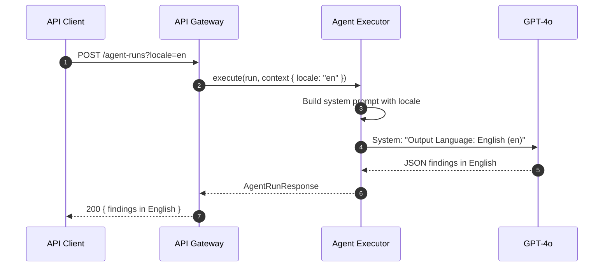
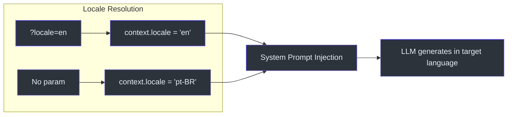

# F10: Multi-Language AI Output

## Why This Exists

Standard GRC serves Brazilian and international enterprises. A CISO at a São Paulo SaaS company needs board reports in Portuguese, while their ISO 27001 auditor from Deloitte needs the same findings in English. Without native multi-language support, customers would need to manually translate 300+ control findings — defeating the purpose of AI-driven automation.

The solution: a `locale` parameter threaded from the API layer through the agent executor into the LLM system prompt, ensuring all AI output respects the requested language.

---

## Architecture





---

## Implementation

### Locale in Agent Runtime Context

The `locale` field is added to `AgentRuntimeContextSchema` in `packages/schemas`:

```typescript
locale: z.enum(["pt-BR", "en"]).default("pt-BR")
```

(`packages/schemas/src/agent-runtime.ts`)

### System Prompt Injection

The executor resolves the locale and injects it into the LLM system prompt:

```typescript
const locale = context.locale ?? "pt-BR";
const localeName = locale === "pt-BR" ? "Brazilian Portuguese" : "English";

const systemPrompt = `You are the ${contract.display_name}.
Responsibility: ${contract.responsibility}
Output Language: ${localeName} (${locale}). Write ALL findings, summaries,
recommendations, and field values in ${localeName}.`;
```

(`packages/agent-runtime/src/executor.ts:97-103`)

### API Route Threading

The API route reads `?locale=` from the query string and injects it into the agent execution context:

```typescript
// In agent-runtime.routes.ts
const locale = url.searchParams.get("locale") ?? "pt-BR";
context.locale = locale;
```

(`apps/api-gateway/src/routes/agent-runtime.routes.ts`)

### Report Renderer Labels

The Markdown renderer uses a bilingual label map:

```typescript
const LABELS = {
  "en": { summary: "Executive Summary", findings: "Findings", ... },
  "pt-BR": { summary: "Resumo Executivo", findings: "Achados", ... }
};
```

(`packages/reporting/src/renderers/markdown-renderer.ts`)

---

## Supported Locales

| Locale | Language | Default? |
|--------|----------|----------|
| `pt-BR` | Brazilian Portuguese | ✅ Yes |
| `en` | English | No |

---

## API Usage

```bash
# English output
curl -X POST "$BASE/assessments/$ID/agent-runs?locale=en" \
  -H "Authorization: Bearer $API_KEY"

# Portuguese (default)
curl -X POST "$BASE/assessments/$ID/agent-runs" \
  -H "Authorization: Bearer $API_KEY"
```

### SDK

```typescript
const run = await client.agents.execute(assessmentId, {
  agent_id: "evidence-evaluator",
  locale: "en",
  input: { controlRequirement: "...", evidenceDescription: "..." }
});
// run.output.auditor_notes → in English
```

---

## Affected Components

| Component | File | Change |
|-----------|------|--------|
| Schemas | `packages/schemas/src/agent-runtime.ts` | Added `locale` field |
| Executor | `packages/agent-runtime/src/executor.ts` | System prompt injection |
| API Routes | `apps/api-gateway/src/routes/agent-runtime.routes.ts` | Query param threading |
| Renderer | `packages/reporting/src/renderers/markdown-renderer.ts` | Bilingual labels |

---

## References

- [executor.ts](file:///c:/Users/resper/OneDrive/%C3%81rea%20de%20Trabalho/aegis-api/packages/agent-runtime/src/executor.ts#L97-L103) — Locale resolution and prompt injection
- [agent-runtime.routes.ts](file:///c:/Users/resper/OneDrive/%C3%81rea%20de%20Trabalho/aegis-api/apps/api-gateway/src/routes/agent-runtime.routes.ts) — API query param handling
- [Product Discovery](file:///C:/Users/resper/.gemini/antigravity/brain/8b7edf93-654e-46ce-9ba7-5bc0083291dc/product_discovery.md) — F10 RICE score: 600 (highest)
