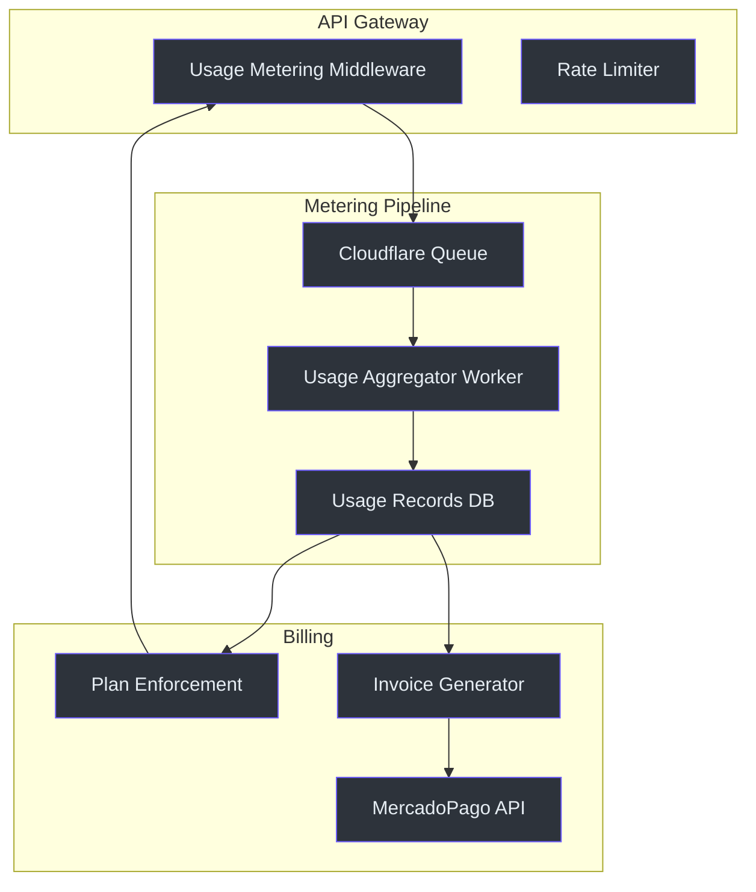
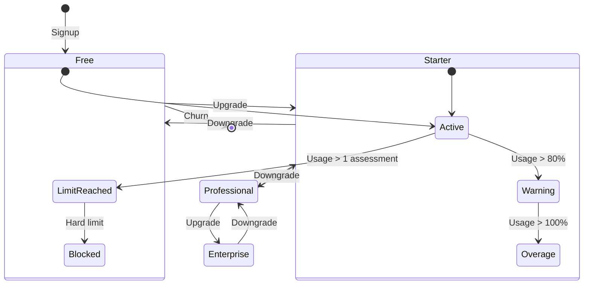
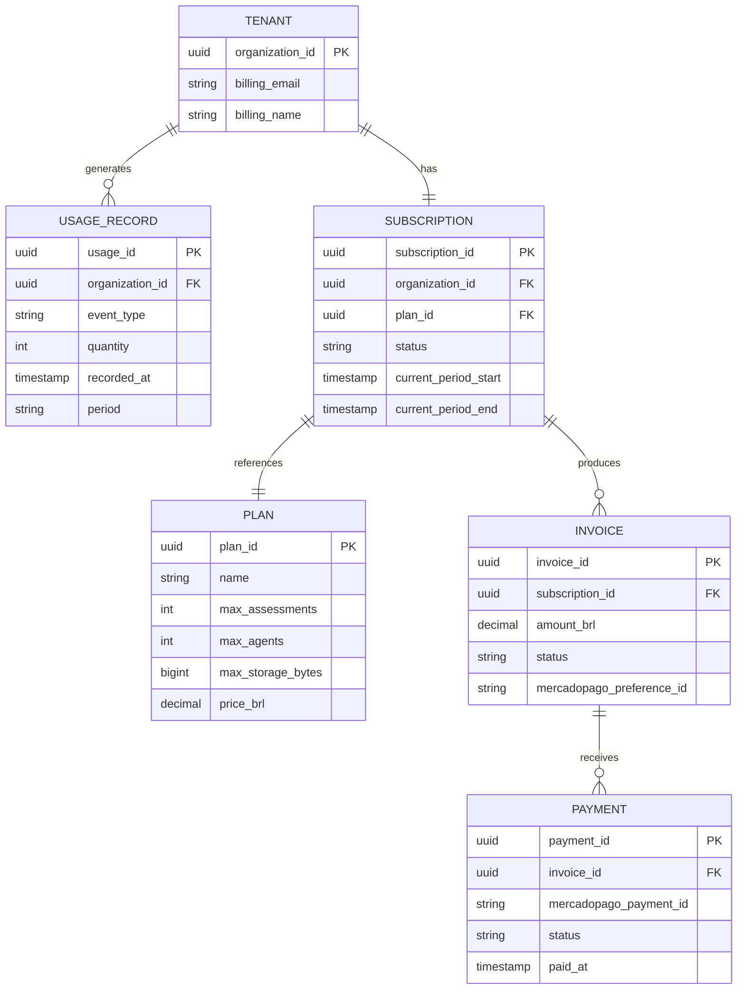

# F11: Usage Metering and Billing

> **Status: Future Implementation** — This feature is planned but not yet implemented. This page documents the architectural design and integration strategy.

## Why This Exists

Standard GRC is an API-first SaaS — every assessment, document upload, and agent execution consumes compute. Without metering, there's no way to enforce plan limits, bill customers accurately, or understand unit economics. F11 establishes the billing foundation: usage metering at the API layer, plan enforcement middleware, and MercadoPago integration for the Brazilian market.

---

## Architecture





---

## Planned Components

### 1. Usage Metering Middleware

Every API request passes through a metering middleware that records billable events:

| Event | Unit | Weight |
|-------|------|--------|
| `assessment.created` | Assessment | 1 |
| `document.uploaded` | Document | 1 |
| `agent.executed` | Agent Run | 1 |
| `report.generated` | Report | 1 |
| `api.request` | Request | 1 |
| `storage.bytes` | MB | per MB |

**Implementation location:** `apps/api-gateway/src/middleware/usage-metering.ts` (planned)

### 2. Plan Definitions

| Plan | Assessments/mo | Agents/mo | Storage | Price (BRL) |
|------|---------------|-----------|---------|-------------|
| **Free** | 1 | 5 | 100 MB | R$ 0 |
| **Starter** | 5 | 50 | 1 GB | R$ 497/mo |
| **Professional** | 20 | 200 | 10 GB | R$ 1.497/mo |
| **Enterprise** | Unlimited | Unlimited | 100 GB | Custom |

**Implementation location:** `packages/billing/src/plans.ts` (planned)

### 3. MercadoPago Integration

MercadoPago is the primary payment processor for the Brazilian market:

```typescript
// Planned SDK integration
const preference = await mercadopago.preferences.create({
  items: [{
    title: "Standard GRC - Professional Plan",
    unit_price: 1497.00,
    currency_id: "BRL",
    quantity: 1,
  }],
  payer: { email: organization.billing_email },
  back_urls: {
    success: `${BASE}/billing/success`,
    failure: `${BASE}/billing/failure`,
    pending: `${BASE}/billing/pending`,
  },
  notification_url: `${BASE}/webhooks/mercadopago`,
});
```

### 4. Usage Dashboard API

Planned endpoints:

| Method | Path | Description |
|--------|------|-------------|
| GET | `/api/v1/organizations/:id/usage` | Current period usage summary |
| GET | `/api/v1/organizations/:id/usage/history` | Usage history by period |
| GET | `/api/v1/organizations/:id/billing/plan` | Current plan details |
| POST | `/api/v1/organizations/:id/billing/upgrade` | Initiate plan upgrade |
| GET | `/api/v1/organizations/:id/billing/invoices` | Invoice history |

---

## Data Model (Planned)



---

## Implementation Strategy

1. **Phase 1 — Metering only** (no billing): Record usage events via Cloudflare Queue. Display on admin dashboard. No enforcement.
2. **Phase 2 — Plan enforcement**: Add soft limits (warnings) and hard limits (403 responses) based on plan.
3. **Phase 3 — MercadoPago integration**: Checkout flow, webhook handler, invoice generation.
4. **Phase 4 — Self-service billing**: Organization-facing billing dashboard with upgrade/downgrade, invoice download.

---

## Dependencies

| Dependency | Purpose | Status |
|-----------|---------|--------|
| Cloudflare Queues | Async usage event processing | ✅ Available |
| Neon PostgreSQL | Usage records and billing state | ✅ Available |
| MercadoPago SDK | Payment processing | 🔲 Not integrated |
| Cloudflare KV | Usage counters (hot path) | ✅ Available |

---

## References

- [Implementation Plan](file:///C:/Users/resper/.gemini/antigravity/brain/8b7edf93-654e-46ce-9ba7-5bc0083291dc/implementation_plan.md#L65) — F11 noted as future implementation
- [Product Discovery](file:///C:/Users/resper/.gemini/antigravity/brain/8b7edf93-654e-46ce-9ba7-5bc0083291dc/product_discovery.md) — Pricing model context
- [MercadoPago Docs](https://www.mercadopago.com.br/developers/pt/docs) — Payment API reference
