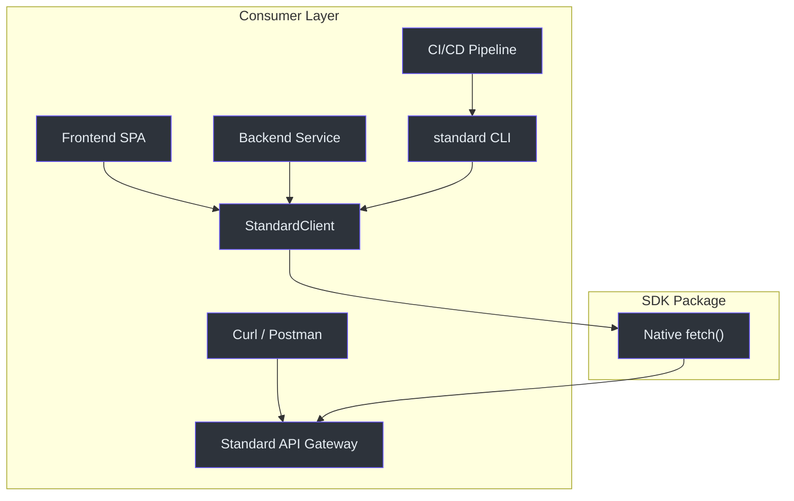
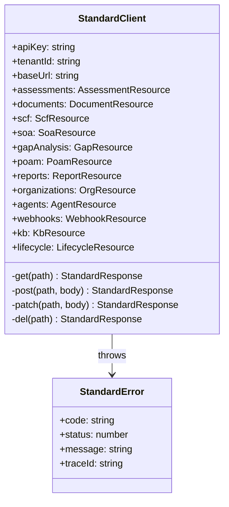
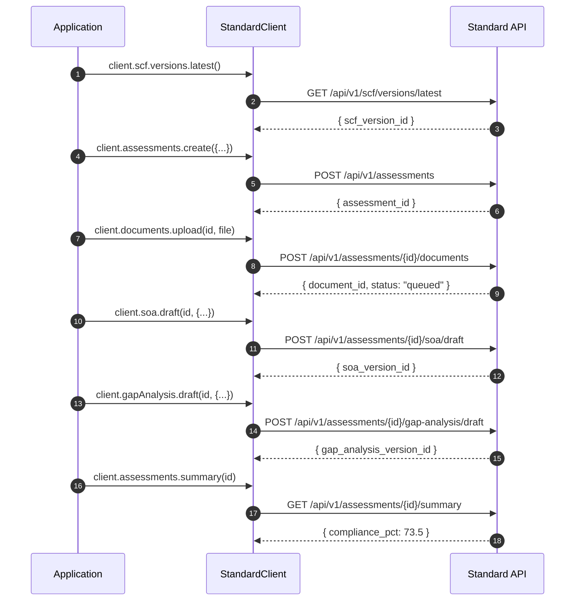

# F8: SDK + CLI

## Why This Exists

An API without a typed SDK forces every consumer to hand-craft HTTP requests, parse errors, and manage authentication. For GRC — where a typical integration involves 14+ sequential API calls across 6 resource types — this is untenable. The SDK provides a zero-dependency, fully typed client that works everywhere `fetch` exists, plus a CLI for quick terminal operations and CI/CD pipelines.

---

## Architecture





---

## Components

### SDK Client (`packages/sdk/src/client.ts`)

The `StandardClient` class provides namespaced resource access to all API endpoints. It uses a single `fetch` call per operation with typed generics.

| Namespace | Methods | Endpoint Prefix |
|-----------|---------|----------------|
| `client.assessments` | list, get, create, update, summary, complianceGate, auditLogs | `/assessments` |
| `client.organizations` | create, get, dashboard, auditLogs, listMembers, inviteMember, updateMemberRole, removeMember | `/organizations` |
| `client.documents` | upload, list, get, reprocess, chunks | `/documents` |
| `client.scf.versions` | list, latest, controls, domains | `/scf/versions` |
| `client.scf.frameworks` | list, get, requirements, coverage | `/scf/frameworks` |
| `client.scf.controls` | byCode, get, mappings | `/scf/controls` |
| `client.soa` | draft, versions, items, review, approve | `/soa` |
| `client.gapAnalysis` | draft, versions, findings, review, approve | `/gap-analysis` |
| `client.poam` | draft, versions, items, milestones, dependencies | `/poam` |
| `client.reports` | generate, download, generateAuditPackage | `/reports` |
| `client.agents` | list, execute, get, toolCalls | `/agent-runs` |
| `client.webhooks` | create, list, get, update, delete, deliveries | `/webhooks` |
| `client.kb` | search, stats, chunks | `/kb` |
| `client.lifecycle` | transition, events, availableTransitions | `/lifecycle` |

**Total: 60+ typed methods.**

### Models (`packages/sdk/src/models.ts`)

All response types are defined in a single file for zero-dependency consumption:

```typescript
export interface AssessmentSummary {
  assessment_id: string;
  compliance_pct: number;
  total_controls: number;
  implemented_controls: number;
  critical_findings: number;
  high_findings: number;
  open_poam_items: number;
  maturity_avg: number;
}
```

(`packages/sdk/src/models.ts:375-442`)

### CLI (`packages/sdk/src/cli.ts`)

Command-line interface wrapping the SDK. Uses `commander` for argument parsing.

```
$ standard login              # Store API key
$ standard assess --framework soc2  # Create assessment
$ standard gate --assessment-id <id> # CI/CD compliance check
```

(`packages/sdk/src/cli.ts`)

### Error Class (`packages/sdk/src/errors.ts`)

```typescript
export class StandardError extends Error {
  code: string;     // "NOT_FOUND", "FORBIDDEN", etc.
  status: number;   // HTTP status
  traceId?: string; // For support escalation
}
```

(`packages/sdk/src/errors.ts`)

---

## Data Flow: Full Assessment via SDK



---

## Platform Compatibility

| Platform | Status |
|----------|--------|
| Node.js 18+ | ✅ |
| Deno | ✅ |
| Bun | ✅ |
| Cloudflare Workers | ✅ |
| Browsers (CORS) | ✅ |

**Zero dependencies.** Uses native `fetch` API only.

---

## References

- [client.ts](file:///c:/Users/resper/OneDrive/%C3%81rea%20de%20Trabalho/aegis-api/packages/sdk/src/client.ts) — 565 lines, 60+ methods
- [models.ts](file:///c:/Users/resper/OneDrive/%C3%81rea%20de%20Trabalho/aegis-api/packages/sdk/src/models.ts) — 442 lines, all response types
- [cli.ts](file:///c:/Users/resper/OneDrive/%C3%81rea%20de%20Trabalho/aegis-api/packages/sdk/src/cli.ts) — CLI entrypoint
- [errors.ts](file:///c:/Users/resper/OneDrive/%C3%81rea%20de%20Trabalho/aegis-api/packages/sdk/src/errors.ts) — StandardError class
- [SDK README](file:///c:/Users/resper/OneDrive/%C3%81rea%20de%20Trabalho/aegis-api/packages/sdk/README.md) — Usage examples
