# Functional Architecture Diagram

This document describes the functional architecture of the **Standard GRC Platform** (Standard GRC API & Ecosystem), showcasing the user roles, system boundaries, workflows, agentic assessment model, and transactional data flow.

## Functional Architecture (Mermaid Diagram)

```mermaid
flowchart TB
    %% --- Subgraphs / System Boundaries ---
    subgraph Actors["User Roles & Interfaces"]
        PA[Platform Admin<br/>Bekaa Operator]
        OU[Org User<br/>Owner / Assessor / Approver]
        FE[Platform Console UI<br/>Web App / apps/web]
        CLI[SDK & CLI Consumers]
    end

    subgraph Gateway["API Gateway / Edge Router (apps/api-gateway)"]
        Auth[Identity & Auth Middleware<br/>Better Auth / API Key]
        TenantDb[Tenant Isolation Middleware<br/>RLS context resolver]
        RBAC[RBAC Gatekeeper<br/>assertRbac / scf:read / organization:update]
        APIKeys[API Keys Controller<br/>M2M Keys Manager]
        Controllers[API Route Handlers<br/>Assessments, Documents, Gaps, POAM]
    end

    subgraph Orchestration["Cloudflare Edge & Durability Stack"]
        CFWorkflows[Cloudflare Workflows<br/>State transitions & Checkpoints]
        CFQueues[Cloudflare Queues<br/>Ingestion & Async Tasks]
        CFStorage[(Cloudflare R2 Storage<br/>Evidence & PDFs)]
    end

    subgraph AgentRuntime["Standard SCF Agentic Assessment Model"]
        Orchestrator[Agent Orchestrator<br/>LLM orchestration, prompt templates]
        Steward[Standard Knowledge Steward<br/>KB evidence organization]
        Analyst[Standard SCF Control Analyst<br/>Control & mapping analyzer]
        ScopeSoA[Standard Scope & SoA Architect<br/>Scope & SoA draft generator]
        EvidenceAnalyst[Standard Evidence Analyst<br/>Evidence classification]
        GapAnalyst[Standard Gap Analyst<br/>Gap analysis proposer]
        MaturityAssessor[Standard Maturity Assessor<br/>Maturity suggestions]
        POAMPlanner[Standard POA&M Planner<br/>Milestone & remediation builder]
        ReportWriter[Standard Assessment Report Writer<br/>Export builder]
    end

    subgraph DataStore["Data & Indexing Layer"]
        DB[(Neon PostgreSQL Database<br/>Users, Orgs, Assessments, Audit Logs)]
        VectorDb[(Vectorize DB<br/>Client semantic KB index)]
    end

    subgraph ApprovalGates["Human-in-the-Loop (HITL) Gates"]
        SoAGate{SoA Approval}
        GapGate{Gap Approval}
        MaturityGate{Maturity Approval}
        PoamGate{POA&M Approval}
    end

    %% --- Connections & Data Flows ---
    PA -->|Manages Platform| FE
    OU -->|Uses Platform| FE
    CLI -->|Calls API| Auth
    FE -->|Requests| Auth

    Auth --> TenantDb
    TenantDb --> RBAC
    RBAC --> Controllers

    Controllers -->|Saves state / queries| DB
    Controllers -->|Uploads docs| CFQueues
    CFQueues -->|Persists docs| CFStorage
    CFQueues -->|Extracts chunks| VectorDb
    
    Controllers -->|Starts lifecycle| CFWorkflows
    CFWorkflows -->|Orchestrates| Orchestrator
    
    %% Agent mappings
    Orchestrator --> Steward
    Orchestrator --> Analyst
    Orchestrator --> ScopeSoA
    Orchestrator --> EvidenceAnalyst
    Orchestrator --> GapAnalyst
    Orchestrator --> MaturityAssessor
    Orchestrator --> POAMPlanner
    Orchestrator --> ReportWriter

    %% Agent data access
    Steward <-->|Organizes evidence| VectorDb
    Analyst -->|Reads rules| DB
    ScopeSoA -->|Saves scope draft| CFWorkflows
    EvidenceAnalyst -->|Validates evidence| CFStorage
    GapAnalyst -->|Finds gaps| CFWorkflows
    MaturityAssessor -->|Suggests maturity| CFWorkflows
    POAMPlanner -->|Plans poam| CFWorkflows

    %% Workflow Wait State & Gates
    CFWorkflows -->|Wait for human sign-off| SoAGate
    CFWorkflows -->|Wait for human sign-off| GapGate
    CFWorkflows -->|Wait for human sign-off| MaturityGate
    CFWorkflows -->|Wait for human sign-off| PoamGate

    SoAGate -->|Approved| CFWorkflows
    GapGate -->|Approved| CFWorkflows
    MaturityGate -->|Approved| CFWorkflows
    PoamGate -->|Approved| CFWorkflows

    CFWorkflows -->|Generates reports| ReportWriter
    ReportWriter -->|Uploads report| CFStorage
```

## Functional Modules Description

### 1. Identity & Auth Edge (Better Auth)
Handles user session resolution, registration approval gates, and Machine-to-Machine (M2M) API keys. Automatically hooks into the gateway middleware to map active organization sessions.

### 2. Tenant & Organization Context Resolver
Ensures strict multi-tenant data isolation. Platform admins are auto-scoped to the operator tenant (`bekaa`), while organization users are restricted to their active workspace ID. All database transactions are scoped with `organization_id`.

### 3. Cloudflare Workflows Orchestrator
A stateful, durable state machine that drives the **Standard GRC Assessment Lifecycle**. It checkpoints progress and transitions through lifecycle states (from `draft` to `closed`) while pausing at Human-in-the-Loop (HITL) approval gates.

### 4. Agentic Assessment Runtime
Orchestrates collaborative specialist AI agents under strict schema validation:
- **Standard Knowledge Steward**: Manages the customer's Knowledge Base (KB) and evidence mapping.
- **Standard Scope & SoA Architect**: Defines compliance scope and draft Statements of Applicability (SoA).
- **Standard Gap Analyst**: Suggests gaps and compliance deviations.
- **Standard Maturity Assessor**: Suggests maturity scores based on Secure Controls Framework (SCF) guidelines.
- **Standard POA&M Planner**: Designs Plan of Action & Milestones (POA&M) for non-compliant controls.
- **Standard Assessment Report Writer**: Synthesizes and exports reports in DOCX/PDF formats.

### 5. Shared Data Layer
- **Neon PostgreSQL**: Single source of truth for configuration, relational schemas, user contexts, and history.
- **Cloudflare Vectorize**: Serves as the RAG retrieval engine for client evidence.
- **Cloudflare R2**: Secure object store for files and compiled reports.
