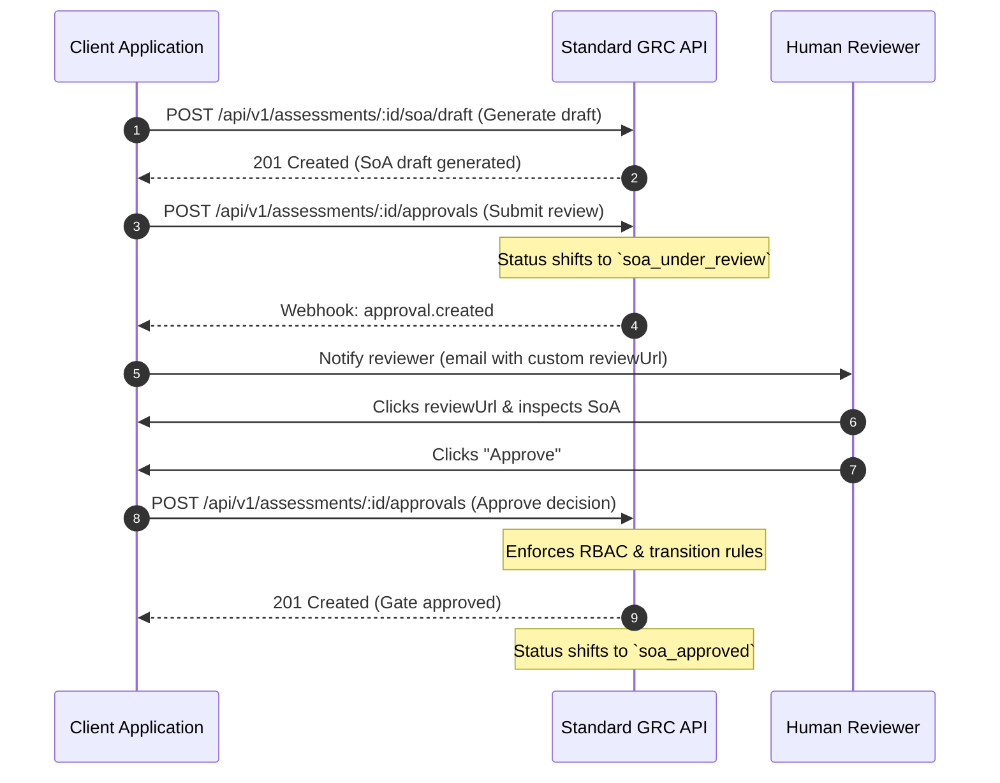

# Human-in-the-Loop (HITL) Integration Guide

This guide explains how to integrate Human-in-the-Loop (HITL) approval workflows with Standard.

## Headless Architecture Principles

> [!IMPORTANT]
> Standard is designed strictly as a **headless GRC intelligence engine** (an API-first "compliance brain"). 
> - Standard does **not** host assessment dashboards, document upload portals, or review screens for end-users.
> - Client applications (the consumers of the Standard API) are fully responsible for hosting the user interface, managing evidence collection, and presenting approval decisions to human authorized actors.

Accordingly, the HITL approval system operates under a delegative headless model:
1. Standard manages the **lifecycle state** and **authorization checks** (RBAC).
2. Standard dispatches asynchronous **Webhooks** and **Emails** when a state transition requires human intervention.
3. The consuming application resolves these gates by presenting the evidence to a human actor and sending the decision back via Standard's secure endpoints.

---

## The 4 Compliance Approval Gates

The Standard GRC assessment lifecycle defines four mandatory human approval gates:

| Gate | Required Permission | Target Type | Target ID | Description |
|---|---|---|---|---|
| **Statement of Applicability (SoA)** | `soa:approve` | `assessment_state` | `assessment_id` | Approves which controls are applicable/non-applicable. |
| **Gap Analysis** | `gap:approve` | `artifact_version` | `gap_analysis_id` | Verifies the compliance findings and missing controls list. |
| **Maturity Assessment** | `maturity:approve` | `artifact_version` | `maturity_assessment_id` | Verifies the maturity tier assigned to implemented controls. |
| **POA&M (Remediation)** | `poam:approve` | `artifact_version` | `poam_id` | Approves remediation milestones, resources, and deadlines. |

---

## Configuring the `reviewUrl`

When an approval request email notification is sent by the platform (e.g. `approval_request` template), it contains a **Review & Approve** button.

Standard does **not** host this review page. The `reviewUrl` sent in email notifications must point directly to your own front-end portal where the reviewer can inspect the assessment.

Configure this URL per organization/workspace context or pass it dynamically as a parameter in your notification requests:

```json
{
  "type": "approval_request",
  "to": "compliance-officer@yourcompany.com",
  "artifactName": "Statement of Applicability v1",
  "assessmentName": "ISO 27001 Q4 Audit",
  "organizationName": "Acme Corp",
  "submittedBy": "system-agent@standard-grc.com",
  "reviewUrl": "https://grc.yourcompany.com/assessments/7fe07587/soa"
}
```

---

## Step-by-Step HITL Approval Workflow

Here is the full flow required to resolve an approval gate:



### 1. Webhook Notification
When an approval request is created, Standard emits an `approval.created` webhook. Your backend should listen to this webhook to trigger custom notification pipelines (Slack alerts, in-app badges, etc.):

```json
{
  "event": "approval.created",
  "timestamp": "2026-06-08T13:34:20Z",
  "organization_id": "11111111-1111-4111-8111-111111111111",
  "trace_id": "trace-approval-001",
  "data": {
    "approval_id": "99999999-9999-9999-9999-999999999999",
    "assessment_id": "7fe07587-d2f3-49ce-87df-bb814113585e",
    "gate": "soa",
    "target_type": "assessment_state",
    "target_id": "7fe07587-d2f3-49ce-87df-bb814113585e",
    "status": "pending"
  }
}
```

### 2. Querying Pending Approvals
Consuming applications can display a global approvals feed for auditors by fetching the organization's pending approvals:

**Request:**
```bash
curl -X GET https://api.standard-grc.com/api/v1/assessments/7fe07587-d2f3-49ce-87df-bb814113585e/approvals \
  -H "Authorization: Bearer standard_live_..." \
  -H "x-standard-tenant-id: 11111111-1111-4111-8111-111111111111"
```

### 3. Submitting the Approval Decision
When the human reviewer clicks approve, your backend must submit the decision to Standard. Standard requires the `x-standard-actor-id` representing the user who made the decision, and performs validation to verify their role corresponds to the required permission:

**Request:**
```bash
curl -X POST https://api.standard-grc.com/api/v1/assessments/7fe07587-d2f3-49ce-87df-bb814113585e/approvals \
  -H "Authorization: Bearer standard_live_..." \
  -H "x-standard-tenant-id: 11111111-1111-4111-8111-111111111111" \
  -H "x-standard-actor-id: 44444444-4444-4444-8444-444444444444" \
  -H "Content-Type: application/json" \
  -d '{
    "gate": "soa",
    "target_type": "assessment_state",
    "target_id": "7fe07587-d2f3-49ce-87df-bb814113585e",
    "decision": "approved",
    "reason": "Statement of Applicability satisfies the required scoped controls for standard GRC."
  }'
```

**Response (201 Created):**
```json
{
  "approval_id": "99999999-9999-9999-9999-999999999999",
  "assessment_id": "7fe07587-d2f3-49ce-87df-bb814113585e",
  "gate": "soa",
  "decision": "approved",
  "approved_by": "44444444-4444-4444-8444-444444444444",
  "approved_at": "2026-06-08T13:35:10.000Z",
  "trace_id": "trace-approval-001"
}
```
If the actor does not possess the required permissions (e.g. they hold a `"viewer"` role instead of `"organization_admin"` or `"owner"`), Standard rejects the request with a `403 FORBIDDEN` error.
