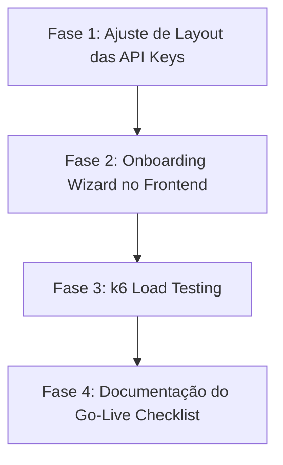

# Plano de Preparação para Produção: API Keys, Onboarding, k6 e Go-Live Checklist

Este documento detalha o planejamento estratégico composto por fases, épicos e issues detalhadas para endereçar as pendências de preparação para produção (Fase 3 e 4 do backlog) da plataforma **Standard**.

---

## 1. Estrutura de Fases do Projeto

A execução do plano é dividida em 4 fases sequenciais:



---

## 2. Épicos e Issues Detalhadas

---

### Épico 1: Ajuste de Layout das API Keys (Self-Service do Tenant)
* **Objetivo:** Reposicionar a rota de gerenciamento de chaves de API para ser um item de nível de plataforma (tenant-specific) no console, em vez de constar como controle de administração global de plataforma.

#### `P3-1.1`: Mover API Keys para NavLinks do Tenant
* **Descrição:** Em `apps/web/src/components/layouts/DashboardLayout.tsx`, mover o item `API Keys` da lista `adminItems` para `navItems`. Isso garante que usuários com acesso comum à organização possam visualizar a tela e gerenciar chaves no escopo do tenant.
* **Arquivos Alvo:**
  * [DashboardLayout.tsx](file:///c:/Users/resper/OneDrive/Área de Trabalho/aegis-api/apps/web/src/components/layouts/DashboardLayout.tsx)
* **Critérios de Aceite:**
  * Link de "API Keys" renderizado na seção superior (Platform) da barra lateral do Platform Console.
  * Mantém todas as funções de listagem, criação e revogação operacionais.

---

### Épico 2: Onboarding Wizard no Frontend
* **Objetivo:** Desenvolver uma interface guiada para que novos usuários cadastrados criem sua primeira organização e possam utilizar os recursos da API.

#### `P3-2.1`: Registrar a Rota do Onboarding
* **Descrição:** Registrar o endpoint `/onboarding` no roteador do frontend React, permitindo que a página seja renderizada de forma protegida (somente usuários autenticados).
* **Arquivos Alvo:**
  * [router.tsx](file:///c:/Users/resper/OneDrive/Área de Trabalho/aegis-api/apps/web/src/router.tsx)
* **Critérios de Aceite:**
  * A rota `/onboarding` renderiza o componente `OnboardingPage` sob o layout do roteador.

#### `P3-2.2`: Desenvolver a Página `OnboardingPage.tsx`
* **Descrição:** Criar o componente de interface `/onboarding` com um formulário limpo e elegante para preenchimento do nome e slug da organização.
  * O formulário deve disparar a criação (`POST /api/v1/organizations`) e, após sucesso, ativar a organização recém-criada (`POST /api/v1/users/me/organizations/:id/activate`) antes de redirecionar para `/dashboard`.
* **Arquivos Alvo:**
  * [OnboardingPage.tsx](file:///c:/Users/resper/OneDrive/Área de Trabalho/aegis-api/apps/web/src/pages/auth/OnboardingPage.tsx) (Novo)
* **Critérios de Aceite:**
  * Interface visual premium utilizando o design system do Standard (aurora glow, dark glassmorphism).
  * Redirecionamento bem-sucedido após a ativação.

#### `P3-2.3`: Redirecionar Automaticamente Usuários sem Organização
* **Descrição:** Ajustar o middleware de auto-ativação do layout principal para que, se o usuário não possuir nenhuma organização na listagem, ele seja redirecionado automaticamente para `/onboarding` para completar o setup básico.
* **Arquivos Alvo:**
  * [DashboardLayout.tsx](file:///c:/Users/resper/OneDrive/Área de Trabalho/aegis-api/apps/web/src/components/layouts/DashboardLayout.tsx)
* **Critérios de Aceite:**
  * Se `orgs.length === 0`, chama `navigate("/onboarding")` em vez de apenas falhar ou ignorar silenciosamente.

---

### Épico 3: Testes de Carga com k6
* **Objetivo:** Criar scripts automatizados de benchmarking de carga para avaliar a estabilidade do gateway de API localmente.

#### `P4-3.1`: Criar o Script `load-test.js`
* **Descrição:** Desenvolver o script de testes com k6 para testar endpoints públicos (`/health`) e protegidos (`/api/v1/assessments` usando header `Authorization: ApiKey <key>`).
* **Arquivos Alvo:**
  * `tests/performance/load-test.js` (Novo)
* **Critérios de Aceite:**
  * Configurar ramp-up de 10 a 50 VUs (Virtual Users) durante 30 segundos.
  * Asserções de sucesso de requisições (>99%) e latência média (<200ms).

---

### Épico 4: Production Go-Live Checklist
* **Objetivo:** Compilar o guia operacional final de validação e checklist de deploy para garantir a integridade da plataforma no go-live.

#### `P4-4.1`: Escrever a Documentação do Checklist Operacional
* **Descrição:** Criar um arquivo markdown contendo o passo a passo final de validação de secrets, neon branching, DNS customizados, CORS e monitoramento do status da API.
* **Arquivos Alvo:**
  * `docs/operations/production-go-live-checklist.md` (Novo)
* **Critérios de Aceite:**
  * Documento detalhado e catalogado no repositório.

---

## 3. Matriz de Dependência e Critérios de Conclusão

```
[Épico 1: Layout API Keys] ──> [Épico 2: Onboarding Wizard] ──> [Épico 3: k6 Testing] ──> [Épico 4: Go-Live Checklist]
```

### Definição de Conclusão (Definition of Done)
1. Código compila sem erros (`pnpm typecheck` ✅).
2. Interface do onboarding operando localmente no console.
3. Script k6 rodando com sucesso.
4. Documentação de checklist criada.
