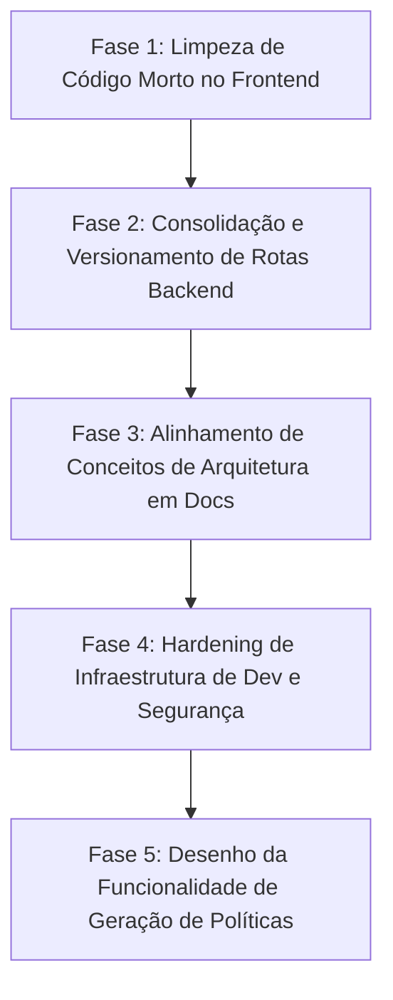

# Plano de Refatoração e Limpeza Geral (Monorepo Standard)

Este documento detalha o planejamento estratégico composto por fases, épicos e issues detalhadas para executar a limpeza de código morto no frontend, consolidar rotas redundantes de convite e observability no backend gateway, corrigir incoerências e conceitos obsoletos na documentação técnica, e robustecer as configurações locais do Docker Compose.

---

## 1. Estrutura de Fases do Projeto

O cronograma de execução está estruturado em 5 fases sequenciais para garantir que as alterações não introduzam regressões funcionais na API ou no Platform Console.



---

## 2. Épicos e Issues Detalhadas

---

### Épico 1: Limpeza do Frontend (Platform Console vs GRC)
* **Objetivo:** Remover todos os artefatos de frontend legados e mortos relacionados ao GRC, que foram transferidos para API-only, simplificando a base do `apps/web` (Platform Console).

#### `CL-1.1`: Deletar Componentes, Hooks e Páginas GRC Mortos
* **Descrição:** Excluir os seguintes arquivos que não fazem mais parte do escopo do console:
  * `apps/web/src/App.tsx` (Antigo roteador morto)
  * `apps/web/src/pages/Login.tsx` (Página de login legada)
  * `apps/web/src/pages/Login.css` (Estilos da página de login legada)
  * `apps/web/src/pages/dashboard/PlaygroundPage.tsx` (Página Playground de testes antigos de agentes)
  * `apps/web/src/pages/admin/Licenses.tsx` (Duplicata de `ApiKeysPage.tsx`)
  * Componentes mortos sob `apps/web/src/components/`:
    * `AssessmentCard.tsx`
    * `AssessmentSelector.tsx`
    * `CreateAssessmentModal.tsx`
    * `GapTable.tsx`
    * `FileUpload.tsx`
    * `Sidebar.tsx` (layout morto)
    * `AppLayout.tsx` (layout morto)
    * `PageTopBar.tsx` (layout morto)
    * `RouteGuards.tsx`
    * `ApiKeysManager.tsx`
    * `AnalyticsDashboard.tsx`
  * Hooks mortos sob `apps/web/src/hooks/`:
    * `use-active-assessment.ts`
    * `use-job-polling.ts`
* **Arquivos Alvo:** Lista de exclusão citada acima.
* **Critérios de Aceite:**
  * Todos os arquivos deletados do repositório.
  * O build do frontend continua passando sem erros de importação perdida.

#### `CL-1.2`: Higienizar `LoginPage.tsx` para Platform Console
* **Descrição:** Modificar os textos de copywriting em `apps/web/src/pages/auth/LoginPage.tsx` que ainda se referem à automação GRC e frameworks do SCF. Mudar o foco para a gestão administrativa de desenvolvedores e tenants.
* **Arquivos Alvo:**
  * [LoginPage.tsx](file:///c:/Users/resper/OneDrive/Área de Trabalho/aegis-api/apps/web/src/pages/auth/LoginPage.tsx)
* **Critérios de Aceite:**
  * "Compliance powered by Agentic AI" → "Standard API Platform"
  * "Automate SOC 2, ISO 27001, HIPAA..." → "Manage organizations, API keys, and integrations"
  * "15k+ Crosswalks..." → Métricas reais da API (ex: API calls, active keys, uptime)
  * "Sign in to your security workspace" → "Sign in to Platform Console"

#### `CL-1.3`: Ajustar Imports no Layout Ativo do Dashboard
* **Descrição:** Revisar `DashboardLayout.tsx` e demais arquivos do Platform Console para remover quaisquer importações não utilizadas de componentes deletados.
* **Arquivos Alvo:**
  * `apps/web/src/components/DashboardLayout.tsx` (ou arquivo equivalente ativo)
* **Critérios de Aceite:**
  * Zero imports de arquivos inexistentes.

---

### Épico 2: Consolidação e Limpeza do Backend (Gateway)
* **Objetivo:** Eliminar endpoints duplicados de observability e unificar o fluxo de convites (invites) entre membros e gerenciamento de organização.

#### `BE-2.1`: Consolidar Rotas de Observability
* **Descrição:** Fundir as rotas duplicadas de metrics, security-events e usage sob `/api/v1/observability/*` com as rotas administrativas correspondentes.
* **Arquivos Alvo:**
  * [observability.routes.ts](file:///c:/Users/resper/OneDrive/Área de Trabalho/aegis-api/apps/api-gateway/src/routes/observability.routes.ts)
* **Critérios de Aceite:**
  * Remover rotas duplicadas sem versão.
  * As rotas mantidas devem responder sob a premissa de autenticação e RBAC adequados.

#### `BE-2.2`: Consolidar Fluxo de Convites
* **Descrição:** Fundir os endpoints `POST /api/v1/organizations/:orgId/members` e `POST /api/v1/organizations/:organizationId/invites` para que sigam uma única implementação canônica, eliminando o código duplicado de convites.
* **Arquivos Alvo:**
  * [members.routes.ts](file:///c:/Users/resper/OneDrive/Área de Trabalho/aegis-api/apps/api-gateway/src/routes/members.routes.ts)
  * [organizations-mgmt.routes.ts](file:///c:/Users/resper/OneDrive/Área de Trabalho/aegis-api/apps/api-gateway/src/routes/organizations-mgmt.routes.ts)
* **Critérios de Aceite:**
  * Código de convite unificado em um único endpoint.

---

### Épico 3: Correções Críticas na Documentação (Conceitos & Naming)
* **Objetivo:** Ajustar todos os documentos do diretório `docs/` e `CONTEXT.md` para remover referências a Aegis, conceitos antigos de JWT e provedores externos de auth obsoletos.

#### `DOC-3.1`: Atualizar `arc42.md`
* **Descrição:** Fazer as seguintes correções no `arc42.md`:
  * Corrigir §2.3: Descrever a autenticação baseada no Standard Native Auth com suporte dual (cookies para sessão e API keys para M2M).
  * Corrigir §4.3: Remover a seção sobre blacklist JWT.
  * Corrigir §9: Documentar que as ADR-001 e ADR-003 foram substituídas pela ADR-0005.
* **Arquivos Alvo:**
  * [arc42.md](file:///c:/Users/resper/OneDrive/Área de Trabalho/aegis-api/docs/architecture/arc42.md)
* **Critérios de Aceite:**
  * Documento atualizado e em conformidade com o design system atual do Standard.

#### `DOC-3.2`: Higienizar Outros Documentos do Monorepo
* **Descrição:** Corrigir:
  * `technical-proposal.md`: Remover a nota de decisão aberta de auth.
  * `product-cookbooks.md`: Alterar a descrição do Web App para refletir a gestão do Platform Console.
  * `prd.md`: Neon Auth → Standard Native Auth.
  * `CONTEXT.md`: Incluir dados do Platform Console e autenticação.
  * `docs/plans/README.md`: Indexar os planos recentes.
  * `docs/guides/mcp-server-setup.md`: Aegis → Standard.
* **Arquivos Alvo:** Arquivos da pasta `docs/` e raiz.
* **Critérios de Aceite:**
  * Documentações sem inconsistências arquiteturais.

---

### Épico 4: Hardening de Infraestrutura de Dev e Segurança
* **Objetivo:** Proteger arquivos de configuração local e harmonizar migrações de banco no Docker.

#### `SEC-4.1`: Garantir que `.dev.vars` não seja Commitado
* **Descrição:** Certificar que as chaves de desenvolvimento local (Neon, Google OAuth, Better-Auth) não vazem, auditando o `.gitignore` na raiz e em `apps/api-gateway/`.
* **Arquivos Alvo:**
  * `.gitignore`
* **Critérios de Aceite:**
  * Arquivo `.dev.vars` explicitamente excluído.

#### `INF-4.2`: Ajustar Mapeamento de Migrações no Docker Compose
* **Descrição:** Atualizar `infra/docker/docker-compose.yml` para assegurar que todas as migrações (atualmente 25, do 0000 ao 0024) sejam processadas ao iniciar o banco Postgres.
* **Arquivos Alvo:**
  * `infra/docker/docker-compose.yml`
* **Critérios de Aceite:**
  * O container do banco local executa migrações completas.

---

### Épico 5: Desenho da Geração de Políticas (Policy Generator)
* **Objetivo:** Especificar a arquitetura técnica da funcionalidade de geração de políticas de segurança com inteligência artificial.

#### `POL-5.1`: Documentar a Especificação de Políticas
* **Descrição:** Escrever o documento de design `docs/specs/policy-generator-spec.md` descrevendo a arquitetura e fluxos de prompt para geração de políticas a partir do GAP analysis do assessment.
* **Arquivos Alvo:**
  * `docs/specs/policy-generator-spec.md` (Novo arquivo)
* **Critérios de Aceite:**
  * Especificação técnica salva no repositório.

---

## 3. Matriz de Dependência e Critérios de Conclusão

```
[Épico 1: Limpeza do Frontend] ──> [Épico 2: Consolidação Gateway] ──> [Épico 3: Docs] ──> [Épico 4: Infra/Dev]
```

### Definição de Conclusão (Definition of Done)
1. build do monorepo (`pnpm typecheck`) limpo e sem erros.
2. Suite de testes passando com sucesso (`pnpm test`).
3. Commit realizado de acordo com o padrão (`Co-Authored-By`).
