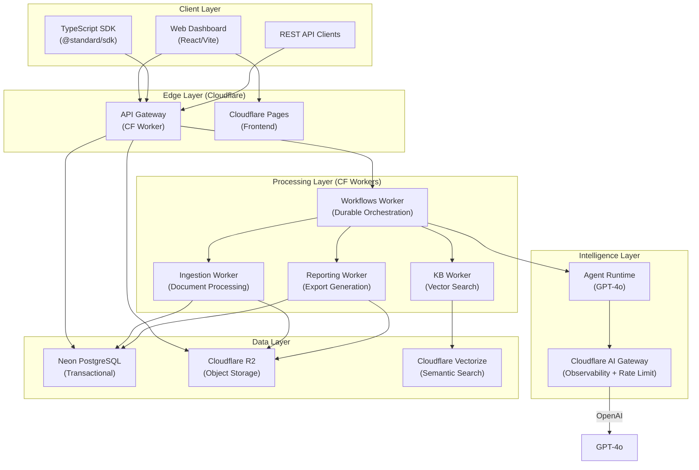
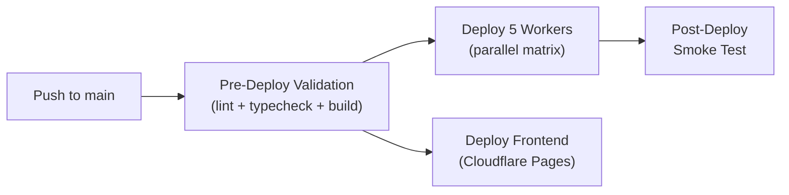

# Product Requirements Document (PRD)
# Standard API — Agentic GRC Platform

> **Version:** 1.0  
> **Date:** 2026-05-19  
> **Status:** Release Candidate  
> **Owner:** Ricardo Esper (resper1965)  
> **License:** BSL-1.1 → Apache 2.0 (auto-convert 2028-05-14)

---

## 1. Executive Summary

**Standard** is an API-first SaaS platform that automates **Governance, Risk & Compliance (GRC)** assessments using the **Secure Controls Framework (SCF)**. It ingests organizational security documents, maps them against **231+ compliance frameworks** via **1,468 SCF controls** and **32,903 requirements**, identifies gaps, scores maturity, generates remediation plans, and produces audit-ready reports — all orchestrated by **7 specialized AI agents** with human-in-the-loop approval gates.

### Value Proposition

> **Your application calls the API — Standard does the compliance intelligence.**

| Metric | Value |
|--------|-------|
| Frameworks supported | 231+ (SOC 2, ISO 27001, HIPAA, NIST, PCI-DSS, GDPR, etc.) |
| SCF Controls | 1,468 |
| Total Requirements | 32,903 |
| Crosswalk Mappings | 15,717 |
| API Endpoints | 86+ |
| AI Agents | 7 specialized + 1 orchestrator |
| Assessment States | 25 |
| Human Approval Gates | 4 |

---

## 2. Product Vision

### 2.1 Problem Statement

Organizations spend **hundreds of hours** and **tens of thousands of dollars** per compliance assessment cycle. Manual processes are error-prone, inconsistent, and don't scale across multiple frameworks. Existing GRC tools are monolithic, expensive, and lack modern API-first integration capabilities.

### 2.2 Solution

Standard provides a **programmable compliance engine** that:

1. **Ingests** organizational documents (policies, procedures, evidence)
2. **Analyzes** them against the SCF's unified control catalog
3. **Maps** to any of 231+ target frameworks automatically
4. **Identifies gaps** between current state and compliance requirements
5. **Scores maturity** across control domains
6. **Generates remediation plans** (POA&M) with actionable steps
7. **Produces reports** in PDF, DOCX, Markdown, and JSON

All through a **RESTful API** that any application can consume.

### 2.3 Target Outcome

Reduce compliance assessment time from **weeks → hours** while improving accuracy, consistency, and auditability.

---

## 3. User Personas

### 3.1 Primary Personas

| Persona | Role | Needs |
|---------|------|-------|
| **CISO / VP Security** | Executive sponsor | Dashboard KPIs, compliance posture, risk overview, board-ready reports |
| **Compliance Manager** | Assessment operator | Run assessments, review SoA/Gap Analysis, approve artifacts, track POA&M |
| **Security Assessor** | Technical evaluator | Upload evidence, analyze controls, validate agent outputs, approve maturity |
| **Developer / DevOps** | Integration builder | API keys, SDK, webhooks, CI/CD compliance gates |
| **Auditor (External)** | Read-only reviewer | Access reports, audit trails, evidence chain, assessment history |

### 3.2 Secondary Personas

| Persona | Role | Needs |
|---------|------|-------|
| **Organization Admin** | Tenant administrator | Manage members, roles, API keys, billing |
| **Contributor** | Evidence provider | Upload documents, respond to information requests |

---

## 4. System Architecture

### 4.1 Architecture Overview



### 4.2 Monorepo Structure

```
standard-api/
├── apps/
│   ├── api-gateway/          # Cloudflare Worker — REST API (86+ endpoints)
│   └── web/                  # React/Vite SPA — Dashboard UI
├── workers/
│   ├── workflows/            # Durable orchestration (assessment lifecycle)
│   ├── ingestion/            # Document processing (upload → R2 → chunk)
│   ├── kb-worker/            # Knowledge base & vector search
│   └── reporting-worker/     # Report generation (PDF/DOCX/MD/JSON)
├── packages/
│   ├── schemas/              # Zod contracts + Drizzle ORM schema
│   ├── sdk/                  # TypeScript SDK (@standard/sdk)
│   ├── assessment-engine/    # State machine (25 states, 4 approval gates)
│   ├── scf-core/             # SCF catalog (1,468 controls, 231 frameworks)
│   ├── agent-runtime/        # AI agent execution (7 agents + orchestrator)
│   ├── soa/                  # Statement of Applicability engine
│   ├── gap-analysis/         # Gap finding engine
│   ├── poam/                 # POA&M remediation engine
│   ├── kb/                   # Knowledge base (vector search)
│   ├── reporting/            # Report renderers
│   ├── security/             # RBAC, auth, permissions
│   ├── observability/        # Audit logs, metrics, cost tracking
│   ├── document-ingestion/   # File validation, chunking
│   ├── contracts/            # Cross-boundary DTOs
│   └── domain/               # Pure domain rules
├── infra/                    # Cloudflare, Docker, Terraform configs
├── docs/                     # Architecture, API, operations docs
├── evals/                    # Agent evaluation fixtures & golden outputs
└── tests/                    # Contract tests, E2E, security tests
```

### 4.3 Technology Stack

| Layer | Technology | Purpose |
|-------|-----------|---------|
| **Runtime** | Cloudflare Workers | Edge compute, API gateway, processing |
| **Frontend** | React + Vite | Dashboard SPA |
| **Hosting** | Cloudflare Pages | Static frontend CDN |
| **Database** | Neon PostgreSQL (serverless) | Transactional data store |
| **ORM** | Drizzle ORM | Type-safe PostgreSQL access |
| **Storage** | Cloudflare R2 | Document/evidence storage |
| **Vector DB** | Cloudflare Vectorize | Semantic search (bge-base-en) |
| **AI Gateway** | Cloudflare AI Gateway | LLM observability, rate limiting |
| **LLM** | OpenAI GPT-4o | Agent intelligence |
| **Auth** | Neon Auth (JWKS) | Identity, sessions, Google OAuth |
| **Validation** | Zod | Schema validation across all layers |
| **Language** | TypeScript (strict) | End-to-end type safety |
| **Package Manager** | pnpm 9 | Monorepo workspace management |
| **CI/CD** | GitHub Actions | Build, test, deploy pipeline |

---

## 5. Core Features

### 5.1 Assessment Engine (State Machine)

The heart of the platform — a **25-state assessment lifecycle** with **4 human approval gates**:

```
┌─────────────────────────────────────────────────────────────────┐
│                    ASSESSMENT LIFECYCLE                          │
├─────────────────────────────────────────────────────────────────┤
│                                                                  │
│  draft → documents_uploaded → documents_ingested                │
│    → scf_pre_analysis_ready → framework_selected                │
│    → scope_drafted → soa_drafted                                │
│    → soa_under_review → [APPROVAL GATE 1] → soa_approved       │
│    → soa_ingested → evidence_analysis_ready                     │
│    → gap_analysis_drafted                                       │
│    → gap_analysis_under_review → [GATE 2] → gap_analysis_approved│
│    → maturity_assessed                                          │
│    → maturity_under_review → [GATE 3] → maturity_approved       │
│    → poam_drafted                                               │
│    → poam_under_review → [GATE 4] → poam_approved              │
│    → report_generated → closed                                  │
│                                                                  │
│  Special states: archived, cancelled, failed, blocked           │
└─────────────────────────────────────────────────────────────────┘
```

**Key Properties:**
- Artifacts (SoA, Gap Analysis, Maturity, POA&M) are **versioned and immutable** once approved
- Reprocessing creates new versions with full audit trail (reason, previous version, actor, trace)
- State transitions are controlled by **durable workflows** — frontend cannot change state directly
- Every transition is audit-logged with `tenant_id`, `organization_id`, `assessment_id`, and `trace_id`

### 5.2 SCF Data Layer

The **Secure Controls Framework** is the normative source of truth:

| Data Point | Count |
|-----------|-------|
| Controls | 1,468 |
| Requirements | 32,903 |
| Frameworks | 231+ |
| Crosswalk Mappings | 15,717 |
| Source | Official SCF XLSX 2026.1.1 |

**Rules:**
- Mappings are **official only** when present in the structured SCF database
- Agents **cannot invent** crosswalks or infer official mappings
- Every output must record `scf_version` and `framework_id`
- Differentiation is enforced: official mapping vs. technical derivation vs. consultative inference

### 5.3 AI Agent Model

**7 specialized agents** + orchestrator, each with bounded authority:

| Agent | Responsibility | Authority Boundary |
|-------|---------------|-------------------|
| **Knowledge Steward** | Organize KB and evidence | Cannot decide compliance |
| **SCF Control Analyst** | Analyze controls | Cannot create missing mappings |
| **Framework Mapper** | Query SCF mappings | Cannot invent crosswalks |
| **Scope & SoA Architect** | Propose scope and SoA | Cannot finalize without human approval |
| **Evidence Analyst** | Classify evidence | Cannot transform "not evidenced" into failure |
| **Gap Analyst** | Propose gaps | Cannot persist without schema validation + approval |
| **Maturity Assessor** | Suggest maturity scores | Cannot finalize without approval gate |
| **POA&M Planner** | Propose remediation | Cannot publish without approval |
| **Report Writer** | Compile reports | Cannot alter approved findings |

**Agent Runtime Requirements:**
- All outputs are **schema-validated** before persistence
- Agents record: `agent_run_id`, model, `prompt_version`, `input_hash`, `output_hash`, confidence, `trace_id`
- Every agent must declare **premises, limitations, sources, and confidence level**
- Agents cannot write final findings directly — human approval is mandatory

### 5.4 Document Ingestion

```
Upload → Validation → R2 Storage → Chunking → KB Indexing → Vector Embedding
```

- File validation: type, size, signature, malware strategy, permissions
- Storage: Cloudflare R2 with tenant-isolated keys
- Chunking: intelligent document segmentation for evidence retrieval
- Embeddings: Cloudflare AI with `bge-base-en` model
- Evidence chain: document → chunk → origin → date → hash → tenant/org/assessment

### 5.5 Reporting Engine

| Format | Status | Use Case |
|--------|--------|----------|
| **JSON** | ✅ | API consumption, programmatic access |
| **Markdown** | ✅ | Developer-friendly, version-controllable |
| **DOCX** | ✅ | Enterprise distribution, executive review |
| **PDF** | ✅ | Audit-ready, print-friendly |

---

## 6. API Surface (86+ Endpoints)

### 6.1 Authentication & Authorization

| Method | Endpoint | Purpose |
|--------|----------|---------|
| — | All `/api/v1/*` | Requires `Authorization: ApiKey <key>` or JWT session |

**RBAC Roles** (hierarchical): `owner` > `admin` > `assessor` > `contributor` > `auditor_readonly`

**Auth Methods:**
- API Key authentication (SHA-256 hash + timing-safe comparison)
- JWT sessions via Neon Auth (Google OAuth supported)
- Per-tenant rate limiting (sliding window)

### 6.2 Core Assessment Flow

| Method | Endpoint | Purpose |
|--------|----------|---------|
| `POST` | `/api/v1/assessments` | Create assessment |
| `GET` | `/api/v1/assessments` | List assessments |
| `GET` | `/api/v1/assessments/:id` | Get assessment details |
| `POST` | `/api/v1/assessments/:id/documents` | Upload evidence documents |
| `POST` | `/api/v1/assessments/:id/soa/draft` | AI generates Statement of Applicability |
| `POST` | `/api/v1/assessments/:id/soa/approve` | Human approves SoA |
| `POST` | `/api/v1/assessments/:id/gap-analysis/draft` | AI generates Gap Analysis |
| `POST` | `/api/v1/assessments/:id/gap-analysis/approve` | Human approves Gap Analysis |
| `POST` | `/api/v1/assessments/:id/maturity/assess` | AI scores maturity |
| `POST` | `/api/v1/assessments/:id/maturity/approve` | Human approves maturity |
| `POST` | `/api/v1/assessments/:id/poam/draft` | AI generates POA&M remediation plan |
| `POST` | `/api/v1/assessments/:id/poam/approve` | Human approves POA&M |
| `GET` | `/api/v1/assessments/:id/summary` | KPIs (compliance %, gaps by severity, open POAMs) |
| `GET` | `/api/v1/assessments/:id/compliance-gate` | CI/CD pass/fail gate |

### 6.3 SCF Catalog

| Method | Endpoint | Purpose |
|--------|----------|---------|
| `GET` | `/api/v1/scf/frameworks` | List 231+ supported frameworks |
| `GET` | `/api/v1/scf/controls` | Browse 1,468 controls |
| `GET` | `/api/v1/scf/controls/:id` | Control details with crosswalks |

### 6.4 Dashboard & Observability

| Method | Endpoint | Purpose |
|--------|----------|---------|
| `GET` | `/api/v1/organizations/:id/dashboard` | Org-wide compliance KPIs |
| `GET` | `/api/v1/tenants/:id/audit-logs` | Tenant audit trail |
| `GET` | `/api/v1/organizations/:id/audit-logs` | Organization audit trail |

### 6.5 Organization & Member Management

| Method | Endpoint | Purpose |
|--------|----------|---------|
| `POST` | `/api/v1/organizations/:id/members` | Invite member |
| `GET` | `/api/v1/organizations/:id/members` | List members |
| `PATCH` | `/api/v1/members/:id` | Update role |
| `DELETE` | `/api/v1/members/:id` | Remove member |

### 6.6 Documentation Endpoints

| Method | Endpoint | Purpose |
|--------|----------|---------|
| `GET` | `/llms.txt` | AI crawler summary |
| `GET` | `/llms-full.txt` | Complete API context for LLMs |
| `GET` | `/docs/openapi.json` | OpenAPI 3.1 specification |
| `GET` | `/docs/cookbook` | SDK recipes & tutorials |
| `GET` | `/docs` | Interactive Scalar API explorer |
| `GET` | `/health` | Health check (no auth) |

---

## 7. Multi-Tenant Design

### 7.1 Isolation Model

Every critical data flow carries:

```typescript
{
  tenant_id: string;        // Tenant boundary
  organization_id: string;  // Organizational unit
  assessment_id: string;    // Assessment scope
  trace_id: string;         // Request tracing
  agent_run_id?: string;    // AI agent execution ID
}
```

### 7.2 Isolation Boundaries

| Resource | Isolation Method |
|----------|-----------------|
| PostgreSQL rows | `tenant_id` column on all tables |
| R2 objects | Tenant-prefixed keys |
| Vectorize namespaces | Tenant-scoped indexes |
| Audit logs | Tenant-filtered queries |
| Rate limiting | Per-tenant sliding window |
| API Keys | Tenant-scoped, SHA-256 hashed |

---

## 8. Security Model

### 8.1 Authentication

- **API Keys:** SHA-256 hashed storage, timing-safe comparison
- **Sessions:** Neon Auth with JWT validation via JWKS
- **OAuth:** Google OAuth via Neon Auth
- **Rate Limiting:** Per-tenant sliding window algorithm

### 8.2 Authorization (RBAC)

```
owner > admin > assessor > contributor > auditor_readonly
```

| Role | Capabilities |
|------|-------------|
| `owner` | Full access, billing, delete org |
| `admin` | Manage members, API keys, assessments |
| `assessor` | Run assessments, approve artifacts |
| `contributor` | Upload documents, respond to requests |
| `auditor_readonly` | View reports, audit trails (read-only) |

### 8.3 Security Guardrails

- **Prompt injection protection:** Separate instructions, retrieved content, and sources
- **Upload security:** Type, size, signature, malware strategy validation
- **Tenant isolation:** Enforced at database, storage, vector, cache, and log levels
- **Approval gates:** Cannot be bypassed by any actor or agent
- **Audit logging:** All state changes, approvals, uploads, agent outputs, and exports
- **Secret management:** No secrets in git; only secret managers, env vars, or CF bindings
- **Log redaction:** No sensitive document content, full prompts, secrets, or credentials in logs

---

## 9. Frontend Dashboard

### 9.1 Technology

- **Framework:** React 19 + Vite
- **Hosting:** Cloudflare Pages (`standard-web-production`)
- **Design System:** "Trust & Authority" — dark theme, glassmorphism, cyan accents
- **State:** React Query + Context

### 9.2 Key Screens

| Screen | Purpose |
|--------|---------|
| **Dashboard Overview** | Stat cards (assessments, controls, frameworks), greeting, quick actions |
| **Assessments List** | All assessments with status, filters, search |
| **Assessment Detail** | Lifecycle progress, documents, artifacts, approval actions |
| **SCF Explorer** | Browse controls, frameworks, crosswalk mappings |
| **Organization Settings** | Members, roles, API keys, billing |
| **Reports** | Generated reports with download links |
| **Audit Log** | Full audit trail with filterable events |
| **Login** | Email/password + Google OAuth |

---

## 10. SDK & Developer Experience

### 10.1 TypeScript SDK

```typescript
import { StandardClient } from "@standard/sdk";

const client = new StandardClient({
  apiKey: "standard_live_...",
  tenantId: "uuid"
});

// Create assessment
const assessment = await client.assessments.create({
  organization_id: "org-id",
  name: "Q2 2026 Assessment"
});

// Get KPIs
const { data } = await client.assessments.summary("assessment-id");

// Dashboard
const dashboard = await client.organizations.dashboard("org-id");

// Invite member
await client.organizations.inviteMember("org-id", {
  email: "auditor@company.com",
  role: "assessor"
});

// CI/CD compliance gate
const gate = await client.assessments.complianceGate("assessment-id");
if (!gate.pass) process.exit(1);
```

### 10.2 Developer Resources

| Resource | URL |
|----------|-----|
| Interactive API Explorer | `/docs` (Scalar) |
| OpenAPI 3.1 Spec | `/docs/openapi.json` |
| LLM Context (Summary) | `/llms.txt` |
| LLM Context (Full) | `/llms-full.txt` |
| SDK Cookbook | `/docs/cookbook` |
| Code Examples | `examples/` directory |

---

## 11. Infrastructure & Deployment

### 11.1 Production Environment

| Component | Service | URL |
|-----------|---------|-----|
| API Gateway | Cloudflare Worker | `standard-api-gateway-production.ness.workers.dev` |
| Dashboard | Cloudflare Pages | `standard.bekaa.eu` |
| Workflows | Cloudflare Worker | `standard-workflows-production` |
| Ingestion | Cloudflare Worker | `standard-ingestion-worker-production` |
| KB Worker | Cloudflare Worker | `standard-kb-worker-production` |
| Reporting | Cloudflare Worker | `standard-reporting-worker-production` |
| Database | Neon PostgreSQL | Serverless, managed |
| Storage | Cloudflare R2 | Tenant-isolated buckets |
| Vectors | Cloudflare Vectorize | bge-base-en embeddings |
| AI | Cloudflare AI Gateway → OpenAI | GPT-4o with cost tracking |

### 11.2 CI/CD Pipeline



**Pipeline:** GitHub Actions (`deploy-production.yml`)
- **Pre-Deploy:** Lint, typecheck, build validation
- **Workers:** 5 workers deployed in parallel (api-gateway, workflows, ingestion, kb, reporting)
- **Frontend:** Automatic deploy to Cloudflare Pages (`standard-web-production`)
- **Smoke Test:** Health check + API validation post-deploy

### 11.3 Testing Strategy

| Test Type | Command | Scope |
|-----------|---------|-------|
| Unit Tests | `pnpm test:unit` | Package-level logic |
| Contract Tests | `pnpm test:contracts` | API schema compliance |
| Security Tests | `pnpm test:security` | Auth, RBAC, upload validation |
| Regression Tests | `pnpm test:regression` | Agent output stability |
| Agent Evaluations | `pnpm test:evaluations` | AI quality with golden outputs |
| Synthetic E2E | `pnpm test:synthetic-e2e` | Full lifecycle simulation |
| Full CI Suite | `pnpm test:ci` | All of above + build |

---

## 12. Phased Roadmap

### Phase 0: SDLC Organization ✅ (Complete)
- Unified backlog, product docs, ADRs, environment documentation

### Phase 1: Stabilization & Real Infrastructure (Current)
- CI green (`lint` + `typecheck` + `test`)
- Auth & rate limiting validated in staging
- Cloudflare resources provisioned and tested
- PostgreSQL backup/restore documented

### Phase 2: Core Functional Complete
- `packages/maturity` with scoring and tests
- Rejection/rework loops in assessment engine
- Immutability enforcement for approved artifacts
- Real LLM provider via AI Gateway
- Anti-malware scanning for uploads

### Phase 3: Frontend SaaS
- API Playground
- Organization self-service (profile, members, invites)
- API Key self-service (create, revoke, monitor)
- Billing/Plans dashboard
- Onboarding wizard
- Role separation (Master Admin vs Tenant Admin vs User)

### Phase 4: Production Go-Live
- Production checklist executed
- Custom domains configured
- Monitoring & alerting active
- Data retention & legal holds
- SOC/SIEM integration
- Legal/privacy review
- First real tenant onboarded

> Phases 2 and 3 can run partially in parallel. Phase 4 is blocked by all previous phases.

---

## 13. Success Metrics

### 13.1 Product Metrics

| Metric | Target |
|--------|--------|
| Assessment completion rate | > 90% |
| Time to first assessment result | < 4 hours |
| Agent accuracy (vs golden outputs) | > 85% |
| Approval gate compliance | 100% |
| API availability | 99.9% |

### 13.2 Business Metrics

| Metric | Target |
|--------|--------|
| First paying tenant | Phase 4 |
| Frameworks actively used | > 10 |
| Monthly API calls | Tracked via AI Gateway |
| Cost per assessment (LLM) | Tracked via OpenAI cost tracking |

### 13.3 Security Metrics

| Metric | Target |
|--------|--------|
| Tenant isolation violations | 0 |
| Audit log coverage | 100% of state changes |
| Secret leakage in git | 0 |
| Approval gate bypass attempts | 0 |

---

## 14. Non-Functional Requirements

| Requirement | Specification |
|-------------|--------------|
| **Availability** | 99.9% (Cloudflare Workers global edge) |
| **Latency** | < 200ms API response (p95, excluding AI) |
| **Scalability** | Multi-tenant, horizontal (Cloudflare auto-scaling) |
| **Data Residency** | Configurable via R2 regions |
| **Backup** | Neon PostgreSQL point-in-time recovery |
| **Compliance** | BSL-1.1 license, security.txt active |
| **Observability** | Structured logs, audit events, LLM cost tracking |
| **API Versioning** | `/v1` prefix, backward-compatible evolution |

---

## 15. Architectural Decisions Record

| ADR | Decision |
|-----|----------|
| ADR-0001 | GitHub as single source of truth |
| ADR-0002 | Neon PostgreSQL as managed transactional database |
| ADR-0003 | Cloudflare infrastructure automation |
| ADR-0004 | SCF structured data as normative source of truth |
| ADR-0005 | Neon Auth as identity provider |
| ADR-0006 | Drizzle ORM for PostgreSQL |
| ADR-0007 | "Trust & Authority" design system |
| ADR-0008 | SCF Official XLSX 2026.1.1 as data source |
| ADR-0009 | Superpowers SDLC process |

---

## 16. Risks & Mitigations

| Risk | Impact | Mitigation |
|------|--------|------------|
| LLM hallucination in findings | High | Schema validation, human approval gates, golden output regression tests |
| Tenant data leakage | Critical | Row-level isolation, scoped R2 keys, scoped vector namespaces |
| SCF data drift | Medium | Versioned imports, `scf_version` tracking on all outputs |
| Cloudflare service limits | Medium | Rate limiting, queue backpressure, dead-letter handling |
| Single LLM provider dependency | Medium | AI Gateway abstraction, MockLLMProvider for testing, fallback strategy |
| Assessment lifecycle deadlock | Low | `blocked`, `failed`, `cancelled` states, manual override by admin |

---

## 17. Glossary

| Term | Definition |
|------|-----------|
| **SCF** | Secure Controls Framework — unified control catalog mapping 231+ frameworks |
| **SoA** | Statement of Applicability — selected controls applicable to an assessment |
| **Gap Analysis** | Comparison of current state vs. required compliance posture |
| **POA&M** | Plan of Action & Milestones — remediation plan for identified gaps |
| **Maturity** | Capability maturity scoring across control domains |
| **Approval Gate** | Mandatory human review before an artifact becomes final |
| **KB** | Knowledge Base — vector-indexed document store for evidence retrieval |
| **RBAC** | Role-Based Access Control — hierarchical permission model |
| **Tenant** | Isolated organizational unit in multi-tenant architecture |
| **Crosswalk** | Official mapping between SCF controls and framework-specific requirements |
| **Golden Output** | Reference AI agent output used for regression testing |

---

> **This PRD is a living document.** It reflects the current state of the Standard API platform as of 2026-05-19. Update it as the product evolves through its phased roadmap.
